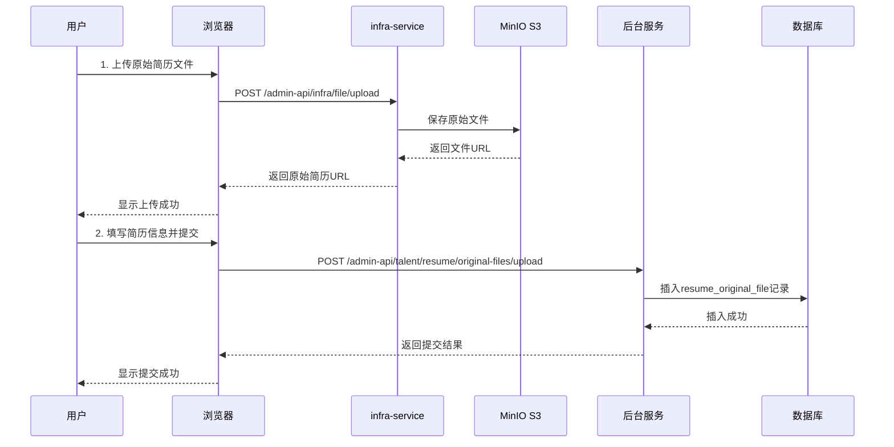
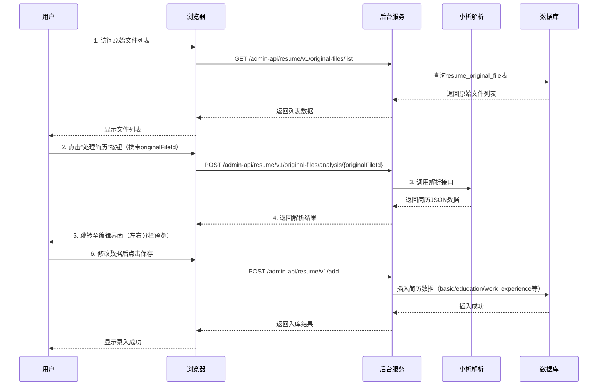
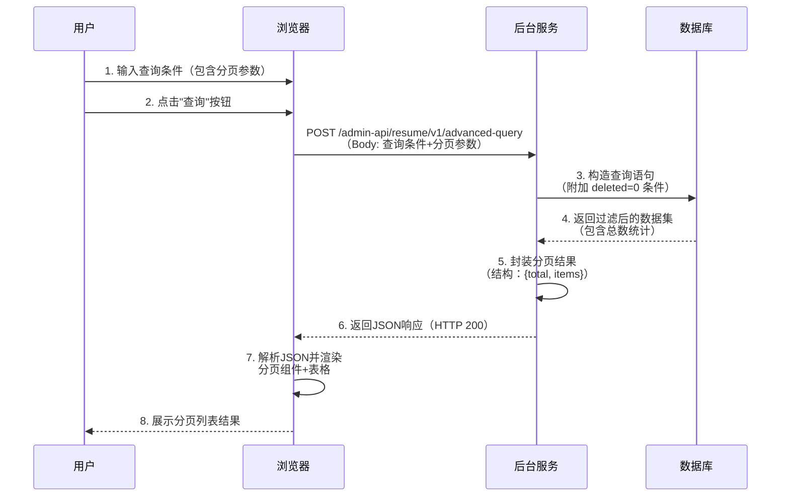
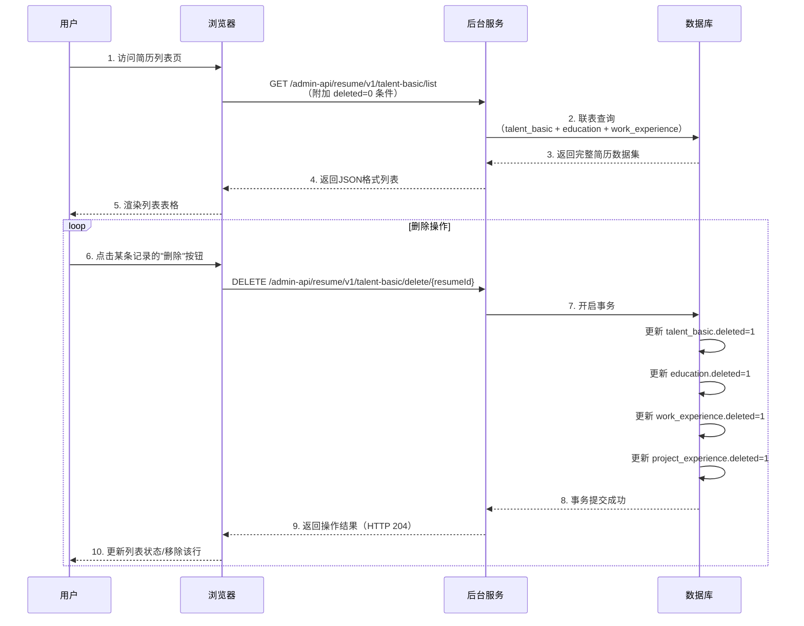
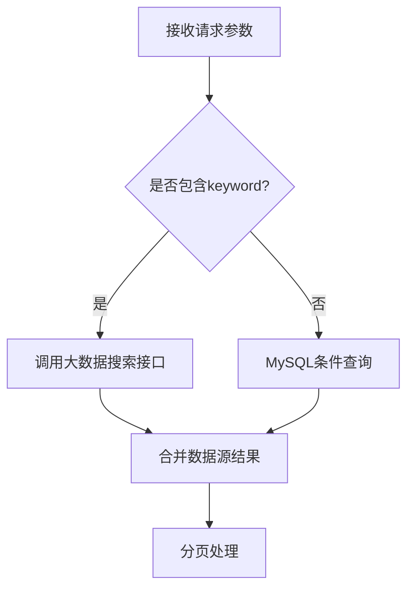

## 业务流程说明（含接口调用）

#### 1. 上传原始简历

- 用户通过浏览器，调用 infra-service 接口 /admin-api/infra/file/upload，upload 原始简历文件
- infra-service 调用 MinIO S3接口保存原始简历文件，获得原始简历文件的 url，并把原始简历文件的 url返回给浏览器
- 用户填写简历文件的相关信息（简历来源、简历语言类型等），点击提交按钮，调用接口  /admin-api/talent/resume/original-files/upload，提交原始简历文件信息发送给后台服务，后台服务在数据库表 **resume_original_file** 中新增一条记录
- resume_id 设置为1L
- original_resume_type 设置为 “new”
- original_attachment_type 设置为 “PDF”
- original_file_status 设置为 “active”
- original_file_handle_status 设置为 “1”




#### 2. 录入简历（处理原始简历文件，处理逻辑参见需求文档）

- 用户通过浏览器，调用后台服务接口 /admin-api/resume/v1/original-files/list 获取原始简历文件列表
- 用户在浏览器页面点击"处理简历"按钮，调用后台服务接口 /admin-api/resume/v1/original-files/analysis/{originalFileId}，对原始简历文件进行分析处理
- 后台服务收到处理简历请求后，调用“小析解析”接口，解析原始简历文件，得到简历 JSON 数据
- 后台服务把简历 JSON 数据，返回给浏览器
- 浏览器界面跳转到简历编辑界面（左边简历原始文件预览，右边分栏表格），用户检查并修改原始简历文件的解析结果，并修改完善简历信息
- 用户在浏览器页面点击保存，调用后台服务接口 /admin-api/resume/v1/add 录入简历信息，完成简历入库




#### 3. 高级查询人才库

- 用户通过浏览器，输入查询条件
- 用户点击"查询"，调用后台服务接口 /admin-api/resume/v1/advanced-query 获取简历信息，JSON格式，不包含已删除简历
- 浏览器页面通过分页列表展示查询结果




#### 4. 删除人才简历

- 用户通过浏览器，通过接口 /admin-api/resume/v1/talent-basic/list 查询获取简历列表信息
- 用户通过浏览器，点击记录对应的"删除"按钮，通过调用 /admin-api/resume/v1/talent-basic/delete/{resumeId} 接口删除对应简历信息，包括教育经历、工作履历、项目经验等。




## 接口设计

#### 1. 简历基本信息管理

###### 1）创建新的人才基本信息记录

`POST /admin-api/resume/v1/talent-basic/create`

**请求体示例**

```json
{
  "resume_language_type": "zh-CN",
  "talent_no": "TN2023001",
  "talent_id": 10001,
  "talent_nationality": "中国",
  "talent_name_zh": "张三",
  "talent_name_py": "Zhang San",
  "talent_name_en": "John",
  "talent_sex": "male",
  "talent_birth_date": "1990-01-01",
  "talent_income_year": "300000",
  "talent_cert_type": "身份证",
  "talent_cert_no": "110101199001011234",
  "talent_start_work": "2012-07-01",
  "talent_education_level": "本科",
  "talent_skills": "Java,MySQL",
  "talent_work_state": "在职",
  "talent_email": "john@example.com",
  "talent_currency": "CNY",
  "talent_country": "中国",
  "talent_native_place": "北京",
  "talent_live_place": "上海市浦东新区",
  "talent_postal_code": "200120",
  "talent_company_telephone": "021-12345678",
  "talent_telephone": "010-87654321",
  "talent_mobilephone": "13800138000",
  "talent_mobile_country": "86",
  "talent_mobile_area": "021",
  "talent_mobile_backup": "13900139000",
  "talent_wechat": "john_zhang",
  "talent_QQ": "12345678",
  "talent_current_workplace": "上海",
  "talent_photo": "/upload/photo.jpg"
}
```

**响应示例**

```json
{
  "code": 0,
  "message": "success",
  "data": {
    "resume_id": 123456
  },
  "timestamp": 1697012345
}
```


###### 2）获取人才分页列表

获取人才基本信息分页数据（支持条件筛选）
`GET /admin-api/resume/v1/talent-basic/list?page=1&pageSize=10`

**查询参数**

| 参数名                 | 类型    | 必填 | 说明               |
| ---------------------- | ------- | ---- | ------------------ |
| page                   | integer | 是   | 页码（从1开始）    |
| pageSize               | integer | 是   | 每页数量（10-100） |
| talent_name_zh         | string  | 否   | 中文名模糊查询     |
| talent_mobilephone     | string  | 否   | 手机号精确查询     |
| talent_education_level | string  | 否   | 按最高教育层次筛选 |

**响应示例**
```json
{
  "code": 0,
  "message": "success",
  "data": {
    "list": [
      {
        "resume_id": 123456,
        "talent_name_zh": "张三",
        "talent_sex": "male",
        "talent_mobilephone": "13800138000",
        "talent_email": "john@example.com",
        "create_time": "2023-10-10 12:00:00"
      }
    ],
    "total": 100,
    "page": 1,
    "pageSize": 10
  },
  "timestamp": 1697012345
}
```

###### 3）获取人才详情

通过 resume_id 获取完整人才信息

`GET /admin-api/resume/v1/talent-basic/detail/{resumeId}`

**路径参数**
- `resumeId`: 简历ID

**响应示例**
```json
{
  "code": 0,
  "message": "success",
  "data": {
    "resume_id": 123456,
    "talent_name_zh": "张三",
    "talent_sex": "male",
    // ...（返回所有字段数据）
    "update_time": "2023-10-10 14:00:00"
  },
  "timestamp": 1697012345
}
```


###### 4）修改人才信息

更新指定 resume_id 的人才信息
`PUT /admin-api/resume/v1/talent-basic/update/{resumeId}`

**请求体** 
同新增接口（只传需要修改的字段）

**响应示例**
```json
{
  "code": 0,
  "message": "success",
  "data": null,
  "timestamp": 1697012345
}
```

###### 5）删除人才信息

逻辑删除指定 resume_id 的记录（设置 deleted=1）

`DELETE /admin-api/resume/v1/talent-basic/delete/{resumeId}`

**响应示例**
```json
{
  "code": 0,
  "message": "success",
  "data": null,
  "timestamp": 1697012345
}
```


#### 2. 简历原始文件管理

###### 6）上传原始简历文件
上传简历文件并创建文件记录（支持PDF/DOC/DOCX格式）

`POST /admin-api/talent/resume/original-files/upload`

**请求头**
`Content-Type: multipart/form-data`

**请求参数**

| 参数名                    | 类型   | 必填 | 说明                                                       |
| ------------------------- | ------ | ---- | ---------------------------------------------------------- |
| original_file_language    | string | 是   | 简历语言类型                                             |
| original_file_path        | string | 是   | 简历URL             |
| original_file_source      | string | 是   | 简历来源（来自单点参数配置）                               |
| original_file_talent_name | string | 是   | 人才姓名（默认从简历解析）                                 |
| original_file_comment     | string | 是   | 备注信息                                                   |

**响应示例**
```json
{
  "code": 0,
  "message": "success",
  "data": {
    "original_file_id": 13579,
    "file_url": "/files/2023/resume_13579.pdf"
  },
  "timestamp": 1697012345
}
```


###### 7）获取原始简历分页列表

获取简历文件分页数据（支持多条件筛选）

`GET /admin-api/talent/resume/original-files/list?page=1&pageSize=10`

**查询参数**

| 参数名                      | 类型    | 必填 | 说明                        |
| --------------------------- | ------- | ---- | --------------------------- |
| page                        | integer | 是   | 页码（从1开始）             |
| pageSize                    | integer | 是   | 每页数量（10-100）          |
| original_file_talent_name   | string  | 否   | 人才姓名模糊查询            |
| original_file_status        | string  | 否   | 状态筛选（active/inactive） |
| original_file_handle_status | string  | 否   | 处理状态筛选（1/0）         |
| original_resume_type        | string  | 否   | 按简历类型过滤              |

**响应示例**
```json
{
  "code": 0,
  "message": "success",
  "data": {
    "list": [
      {
        "original_file_id": 13579,
        "original_file_name": "张三_简历.pdf",
        "original_file_talent_name": "张三",
        "original_resume_type": "new",
        "original_file_status": "active",
        "create_time": "2023-10-10 14:30:00"
      }
    ],
    "total": 85,
    "page": 1,
    "pageSize": 10
  },
  "timestamp": 1697012345
}
```

###### 8）预览原始简历文件

获取简历文件预览内容（返回文件流或预览URL）

`GET /admin-api/talent/resume/original-files/preview/{originalFileId}`

**路径参数**

- `originalFileId`: 简历文件ID

**响应说明**
- 直接返回文件流（自动识别Content-Type）
- 或返回临时预览URL（有效期1小时）

**成功响应头**
```
Content-Type: application/pdf
Content-Disposition: inline; filename="resume.pdf"
```


###### 9）处理简历文件信息

处理（解析）原始简历文件（不可修改文件内容）

`GET /admin-api/talent/resume/original-files/analysis/{originalFileId}`

**请求头**
`Content-Type: application/json`

**URL参数说明**

```json
originalFileId : 原始简历文件ID
```

**响应示例**
```json
{
  "code": 0,
  "message": "success",
  "data": {
      // 简历结构化数据
  },
  "timestamp": 1697012345
}
```


###### 10）删除简历文件信息

逻辑删除指定 originalFileId 的记录（设置 deleted=1）

`DELETE /admin-api/talent/resume/original-files/delete/{originalFileId}`

**响应示例**

```json
{
  "code": 0,
  "message": "success",
  "data": null,
  "timestamp": 1697012345
}
```


#### 3. 人才求职意向管理


###### 11）新增人才求职意向

创建新的人才求职意向记录（单条记录需关联指定简历）

`POST /admin-api/resume/v1/intentions/create`


**请求体字段说明**

| 字段名                 | 类型   | 必填 | 说明                             |
| ---------------------- | ------ | ---- | -------------------------------- |
| resume_language_type   | string | 是   | 简历语言类型（示例：zh-CN）      |
| talent_no              | string | 是   | 人才编号（与简历基础信息关联）   |
| resume_id              | long   | 是   | 简历ID（外键关联）               |
| intention_country      | string | 是   | 意向国家（示例：中国）           |
| intention_city         | string | 是   | 期望工作地（示例：上海）         |
| intention_industry     | string | 是   | 目标行业（示例：互联网）         |
| intention_customer     | string | 是   | 目标客户（示例：外企）           |
| intention_post         | string | 是   | 目标职位（示例：Java开发工程师） |
| intention_work_content | string | 是   | 工作内容趋向（示例：后端开发）   |
| intention_salary       | string | 否   | 期望薪资（示例：30000）          |
| intention_currency     | string | 是   | 使用币种（示例：CNY）            |
| intention_keywords     | string | 是   | 关键字（示例：高薪,弹性工作）    |
| intention_outsource_ok | string | 是   | 是否接受外包岗位                 |
| intention_go_abroad    | string | 否   | 是否接受海外（yes/no）           |

**请求示例**
```json
{
  "resume_language_type": "zh-CN",
  "talent_no": "TN2023001",
  "resume_id": 123456,
  "intention_country": "中国",
  "intention_city": "上海",
  "intention_industry": "互联网",
  "intention_customer": "外企",
  "intention_post": "Java开发工程师",
  "intention_work_content": "后端开发",
  "intention_salary": "30000",
  "intention_currency": "CNY",
  "intention_keywords": "高薪,弹性工作",
  "intention_outsource_ok": "no",
  "intention_go_abroad": "no"
}
```

**响应示例**
```json
{
  "code": 0,
  "message": "success",
  "data": {
    "intention_id": 789
  },
  "timestamp": 1697012345
}
```


###### 12）获取求职意向详情


通过意向ID获取完整的求职意向信息

`GET /admin-api/resume/v1/intentions/detail/{intentionId}`

**路径参数**
- `intentionId`: 求职意向ID

**响应示例**
```json
{
  "code": 0,
  "message": "success",
  "data": {
    "intention_id": 789,
    "resume_language_type": "zh-CN",
    "talent_no": "TN2023001",
    "resume_id": 123456,
    "intention_country": "中国",
    "intention_city": "上海",
    "intention_industry": "互联网",
    // ...（返回所有字段数据）
    "update_time": "2023-10-10 15:00:00"
  },
  "timestamp": 1697012345
}
```


###### 13）修改求职意向信息


更新指定意向ID的可修改字段（不可修改简历ID、人才编号等关联字段）

`PUT /admin-api/resume/v1/intentions/update/{intentionId}`

**请求头**
`Content-Type: application/json`

**可修改字段示例**
```json
{
  "intention_city": "北京",
  "intention_salary": "35000",
  "intention_go_abroad": "yes"
}
```

**响应示例**
```json
{
  "code": 0,
  "message": "success",
  "data": null,
  "timestamp": 1697012345
}
```


###### 14）删除求职意向


逻辑删除指定意向ID的记录（设置 deleted=1）

`DELETE /admin-api/resume/v1/intentions/delete/{intentionId}`

**响应示例**
```json
{
  "code": 0,
  "message": "success",
  "data": null,
  "timestamp": 1697012345
}
```

1. **字段约束**
   - `intention_currency` 需符合 ISO 4217 货币代码标准
   - `intention_go_abroad` 仅允许 `yes/no` 枚举值
2. **关联性验证**
   - 新增/修改操作时会校验 `resume_id` 与 `talent_no` 的关联有效性

3. **数据完整性**
   - 删除操作会级联更新简历完整度字段 `talent_all_integrity`


#### 4. 教育信息管理


###### 15）新增教育信息

创建人才教育经历记录（支持多段教育经历）

`POST /admin-api/resume/v1/educations/create`

**请求体字段说明**

| 字段名                    | 类型   | 必填 | 说明                         |
| ------------------------- | ------ | ---- | ---------------------------- |
| resume_language_type      | string | 是   | 简历语言类型（示例：zh-CN）  |
| talent_no                 | string | 是   | 关联人才编号                 |
| resume_id                 | long   | 是   | 关联简历ID                   |
| graduation_school         | string | 是   | 毕业院校名称                 |
| under_graduation_school   | string | 是   | 本科毕业院校                 |
| education_major           | string | 是   | 专业名称                     |
| education_major_desc      | string | 否   | 专业详细描述（最多512字符）  |
| education_level           | string | 否   | 最高教育层次（示例：硕士）   |
| education_school_level    | string | 否   | 学院级别（示例：985院校）    |
| enrollment_date           | string | 是   | 入学日期（格式：yyyy-MM-dd） |
| graduation_date           | string | 是   | 毕业日期（格式：yyyy-MM-dd） |
| overseas_study_experience | string | 否   | 海外学习经历描述             |
| classmate_name            | string | 否   | 同学姓名                     |
| classmate_mobilephone     | string | 否   | 同学联系电话（需验证格式）   |

**请求示例**
```json
{
  "resume_language_type": "zh-CN",
  "talent_no": "TN2023001",
  "resume_id": 123456,
  "graduation_school": "清华大学",
  "under_graduation_school": "北京大学",
  "education_major": "计算机科学与技术",
  "education_major_desc": "主修分布式系统与人工智能方向",
  "enrollment_date": "2015-09-01",
  "graduation_date": "2019-06-30",
  "overseas_study_experience": "2018年加州大学伯克利分校交换生"
}
```

**响应示例**
```json
{
  "code": 0,
  "message": "success",
  "data": {
    "education_id": 9876
  },
  "timestamp": 1697012345
}
```


###### 16）获取教育信息列表


获取指定简历下的教育经历列表（按毕业时间倒序）

`GET /admin-api/resume/v1/educations/list`

**查询参数**

| 参数名    | 类型   | 必填 | 说明                 |
| --------- | ------ | ---- | -------------------- |
| resume_id | long   | 是   | 关联简历ID           |
| talent_no | string | 否   | 人才编号（辅助验证） |

**响应示例**
```json
{
  "code": 0,
  "message": "success",
  "data": [
    {
      "education_id": 9876,
      "graduation_school": "清华大学",
      "education_major": "计算机科学与技术",
      "enrollment_date": "2015-09-01",
      "graduation_date": "2019-06-30",
      "education_level": "硕士"
    }
  ],
  "timestamp": 1697012345
}
```


###### 17）获取教育信息详情

通过教育记录ID获取完整详细信息

`GET /admin-api/resume/v1/educations/detail/{educationId}`

**路径参数**
- `educationId`: 教育记录ID

**响应示例**
```json
{
  "code": 0,
  "message": "success",
  "data": {
    "education_id": 9876,
    "graduation_school": "清华大学",
    "under_graduation_school": "北京大学",
    "education_major": "计算机科学与技术",
    "education_major_desc": "主修分布式系统与人工智能方向",
    // ...（返回所有字段数据）
    "update_time": "2023-10-10 16:00:00"
  },
  "timestamp": 1697012345
}
```


###### 18）修改教育信息

更新指定教育记录的可修改字段（不可修改关联ID）

`PUT /admin-api/resume/v1/educations/update/{educationId}`

**请求头**  
`Content-Type: application/json`

**可修改字段示例**
```json
{
  "education_level": "博士",
  "overseas_study_experience": "2020-2022年麻省理工学院访问学者",
  "classmate_mobilephone": "13800138000"
}
```

**响应示例**
```json
{
  "code": 0,
  "message": "success",
  "data": null,
  "timestamp": 1697012345
}
```


###### 19）删除教育信息

逻辑删除指定教育记录（设置 deleted=1）

`DELETE /admin-api/resume/v1/educations/delete/{educationId}`

**响应示例**
```json
{
  "code": 0,
  "message": "success",
  "data": null,
  "timestamp": 1697012345
}
```


#### 5. 工作履历管理

###### 20）新增工作履历

创建人才工作经历记录（支持多段经历添加）

`POST /admin-api/resume/v1/work-experiences/add`

**请求头**
`Content-Type: application/json`

**请求体字段说明**

| 字段名                     | 类型    | 必填 | 说明                                  |
|----------------------------|---------|------|---------------------------------------|
| resume_id                  | long    | 是   | 关联简历ID                            |
| talent_no                  | string  | 是   | 人才编号                              |
| work_experience_begin      | string  | 是   | 开始日期（格式：yyyy-MM-dd）          |
| work_experience_end        | string  | 是   | 结束日期（格式：yyyy-MM-dd）          |
| work_experience_company    | string  | 是   | 公司名称（最长64字符）                |
| company_nature             | string  | 是   | 公司性质（示例：外资/国企/民营）      |
| company_industry           | string  | 是   | 所属行业（示例：互联网/金融）         |
| work_post                  | string  | 是   | 担任职位（示例：高级工程师）          |
| job_description            | string  | 否   | 工作描述（最长512字符）               |
| work_leader_contact        | string  | 否   | 领导联系方式（需符合E.164格式）       |
| workmate_name_contact      | string  | 否   | 同事联系方式（需符合E.164格式）       |

**请求示例**
```json
{
  "resume_id": 123456,
  "talent_no": "TN2023001",
  "work_experience_begin": "2019-07-01",
  "work_experience_end": "2023-06-30",
  "work_experience_company": "阿里巴巴集团",
  "company_nature": "民营",
  "company_industry": "互联网",
  "work_post": "高级Java开发工程师",
  "job_description": "负责核心交易系统开发与架构优化",
  "work_leader_contact": "+8613800138000"
}
```

**响应示例**
```json
{
  "code": 0,
  "message": "success",
  "data": {
    "work_experience_id": 5566
  },
  "timestamp": 1697012345
}
```


###### 21）获取工作履历列表

获取指定简历下的工作经历列表（按结束时间倒序）

`GET /admin-api/resume/v1/work-experiences/list`

**查询参数**

| 参数名      | 类型   | 必填 | 说明                |
|-------------|--------|------|---------------------|
| resume_id   | long   | 是   | 关联简历ID          |
| talent_no   | string | 否   | 人才编号辅助验证    |

**响应示例**
```json
{
  "code": 0,
  "message": "success",
  "data": [
    {
      "work_experience_id": 5566,
      "work_experience_company": "阿里巴巴集团",
      "work_post": "高级Java开发工程师",
      "work_experience_begin": "2019-07-01",
      "work_experience_end": "2023-06-30"
    }
  ],
  "timestamp": 1697012345
}
```


###### 22）获取工作履历详情

通过履历ID获取完整工作经历详情

`GET /admin-api/resume/v1/work-experiences/detail/{workExperienceId}`

**路径参数**
- `workExperienceId`: 工作履历ID

**响应示例**
```json
{
  "code": 0,
  "message": "success",
  "data": {
    "work_experience_id": 5566,
    "work_experience_company": "阿里巴巴集团",
    "company_nature": "民营",
    "company_industry": "互联网",
    // ...（返回所有字段数据）
    "update_time": "2023-10-10 17:00:00"
  },
  "timestamp": 1697012345
}
```


###### 23）修改工作履历

更新指定工作履历信息（不可修改关联ID）

`PUT /admin-api/resume/v1/work-experiences/update/{workExperienceId}`

**请求头**  
`Content-Type: application/json`

**可修改字段示例**
```json
{
  "work_post": "技术专家",
  "job_description": "主导系统架构升级项目",
  "work_achieve": "完成日均亿级交易系统优化"
}
```

**响应示例**
```json
{
  "code": 0,
  "message": "success",
  "data": null,
  "timestamp": 1697012345
}
```


###### 24）删除工作履历

逻辑删除指定工作履历（设置 deleted=1）

`DELETE /admin-api/resume/v1/work-experiences/delete/{workExperienceId}`

**响应示例**
```json
{
  "code": 0,
  "message": "success",
  "data": null,
  "timestamp": 1697012345
}
```


1. **数据完整性**
   - 删除操作自动更新简历完整度 `work_experience_integrity`
   - 修改时自动重新计算完整度评分

2. **特殊字段处理**
   ```javascript
   // 日期有效性检查示例
   function validateDate(begin, end) {
     return new Date(begin) < new Date(end);
   }
   
   // 公司性质枚举校验
   const COMPANY_NATURE = ['外资', '合资', '国企', '民营', '事业单位'];
   ```


#### 6. 项目经验管理

###### 25）新增项目经验


关联工作履历创建项目经历（支持多项目嵌套）

`POST /admin-api/resume/v1/project-experiences/add`

**请求头**
`Content-Type: application/json`

**请求体字段说明**

| 字段名                     | 类型    | 必填 | 说明                                  |
|----------------------------|---------|------|---------------------------------------|
| resume_id                  | long    | 是   | 关联简历ID                            |
| work_experience_id         | long    | 是   | 所属工作履历ID                        |
| project_begin              | string  | 是   | 开始日期（格式：yyyy-MM-dd）          |
| project_end                | string  | 是   | 结束日期（格式：yyyy-MM-dd）          |
| project_name               | string  | 是   | 项目名称（最长64字符）                |
| project_desc               | string  | 否   | 项目描述（Markdown格式）              |
| project_hardware_env       | string  | 否   | 硬件环境（示例：AWS EC2集群）         |
| project_technical_index    | string  | 否   | 技术指标（示例：QPS 10万+）           |

**请求示例**
```json
{
  "resume_id": 123456,
  "work_experience_id": 5566,
  "project_begin": "2021-03-01",
  "project_end": "2022-12-31",
  "project_name": "高并发交易系统重构",
  "project_desc": "重构核心交易模块，TPS从5万提升至20万",
  "project_hardware_env": "Kubernetes集群（50+节点）"
}
```

**响应示例**
```json
{
  "code": 0,
  "message": "success",
  "data": {
    "project_experience_id": 7788
  },
  "timestamp": 1697012345
}
```


###### 26）获取项目经验列表

获取指定工作履历下的项目列表（按结束时间倒序）

`GET /admin-api/resume/v1/project-experiences/list`

**查询参数**

| 参数名              | 类型   | 必填 | 说明                    |
|---------------------|--------|------|-------------------------|
| work_experience_id  | long   | 是   | 所属工作履历ID          |
| resume_id           | long   | 否   | 关联简历ID辅助验证      |

**响应示例**
```json
{
  "code": 0,
  "message": "success",
  "data": [
    {
      "project_experience_id": 7788,
      "project_name": "高并发交易系统重构",
      "project_begin": "2021-03-01",
      "project_end": "2022-12-31",
      "project_technical_index": "QPS 20万+"
    }
  ],
  "timestamp": 1697012345
}
```

###### 27）获取项目经验详情

通过项目ID获取完整技术细节

`GET /admin-api/resume/v1/project-experiences/detail/{projectExperienceId}`

**路径参数**
- `projectExperienceId`: 项目经验ID

**响应示例**
```json
{
  "code": 0,
  "message": "success",
  "data": {
    "project_experience_id": 7788,
    "project_name": "高并发交易系统重构",
    "project_desc": "重构核心交易模块，TPS从5万提升至20万",
    "project_hardware_env": "Kubernetes集群（50+节点）",
    // ...（返回所有字段数据）
    "update_time": "2023-10-10 18:00:00"
  },
  "timestamp": 1697012345
}
```


###### 28）修改项目经验

更新项目技术细节（不可修改关联ID）

`PUT /admin-api/resume/v1/project-experiences/update/{projectExperienceId}`

**请求头**
`Content-Type: application/json`

**可修改字段示例**
```json
{
  "project_desc": "[优化] 增加熔断降级机制",
  "project_technical_index": "QPS 25万+（峰值）"
}
```

**响应示例**
```json
{
  "code": 0,
  "message": "success",
  "data": null,
  "timestamp": 1697012345
}
```


###### 29）删除项目经验

逻辑删除项目记录（设置 deleted=1）

`DELETE /admin-api/resume/v1/project-experiences/delete/{projectExperienceId}`

**响应示例**
```json
{
  "code": 0,
  "message": "success",
  "data": null,
  "timestamp": 1697012345
}
```

1. **关联性验证**
   - 新增时校验 `work_experience_id` 属于当前 `resume_id`
   - 修改时禁止跨工作履历关联

2. **完整性计算**
   - 自动根据字段填充率计算 `project_experience_integrity`
   - 关键字段缺失（如项目名称）将导致完整度低于50%


#### 7. 获奖信息管理

###### 30）新增获奖信息

创建人才获奖记录（支持多奖项录入）

`POST /admin-api/resume/v1/awards/add`

**请求头**
`Content-Type: application/json`

**请求体字段说明**

| 字段名                     | 类型    | 必填 | 说明                                  |
|----------------------------|---------|------|---------------------------------------|
| resume_id                  | long    | 是   | 关联简历ID                            |
| talent_no                  | string  | 是   | 人才编号                              |
| award_works_date           | string  | 是   | 获奖日期（格式：yyyy-MM）             |
| talent_award               | string  | 是   | 奖项名称（示例：最佳技术创新奖）      |
| award_unit                 | string  | 是   | 颁奖单位（示例：中国计算机学会）      |
| award_desc                 | string  | 是   | 奖项描述（最多512字符）               |
| award_attach               | string  | 否   | 证书附件路径（OSS存储路径）           |

**请求示例**
```json
{
  "resume_id": 123456,
  "talent_no": "TN2023001",
  "award_works_date": "2023-05",
  "talent_award": "年度杰出工程师",
  "award_unit": "中国软件行业协会",
  "award_desc": "表彰在分布式系统领域的突出贡献",
  "award_attach": "/certificates/2023/award_123.pdf"
}
```

**响应示例**
```json
{
  "code": 0,
  "message": "success",
  "data": {
    "award_works_id": 1122
  },
  "timestamp": 1697012345
}
```


###### 31）获取获奖信息列表

获取指定简历下的获奖记录（按获奖时间倒序）

`GET /admin-api/resume/v1/awards/list`

**查询参数**

| 参数名      | 类型   | 必填 | 说明                |
|-------------|--------|------|---------------------|
| resume_id   | long   | 是   | 关联简历ID          |
| talent_no   | string | 否   | 人才编号辅助验证    |

**响应示例**
```json
{
  "code": 0,
  "message": "success",
  "data": [
    {
      "award_works_id": 1122,
      "talent_award": "年度杰出工程师",
      "award_unit": "中国软件行业协会",
      "award_works_date": "2023-05"
    }
  ],
  "timestamp": 1697012345
}
```


###### 32）获取获奖信息详情

通过奖项ID获取完整证书信息

`GET /admin-api/resume/v1/awards/detail/{awardWorksId}`

**路径参数**
- `awardWorksId`: 获奖记录ID

**响应示例**
```json
{
  "code": 0,
  "message": "success",
  "data": {
    "award_works_id": 1122,
    "talent_award": "年度杰出工程师",
    "award_unit": "中国软件行业协会",
    "award_desc": "表彰在分布式系统领域的突出贡献",
    // ...（返回所有字段数据）
    "update_time": "2023-10-10 19:00:00"
  },
  "timestamp": 1697012345
}
```


###### 33）修改获奖信息

更新奖项描述及附件信息（不可修改关联ID）

`PUT /admin-api/resume/v1/awards/update/{awardWorksId}`

**请求头**
`Content-Type: application/json`

**可修改字段示例**
```json
{
  "award_desc": "[补充] 该奖项年度全国仅10人获得",
  "award_attach": "/certificates/2023/award_123_v2.pdf"
}
```

**响应示例**
```json
{
  "code": 0,
  "message": "success",
  "data": null,
  "timestamp": 1697012345
}
```

###### 34）删除获奖信息

逻辑删除奖项记录（设置 deleted=1）

`DELETE /admin-api/resume/v1/awards/delete/{awardWorksId}`

**响应示例**
```json
{
  "code": 0,
  "message": "success",
  "data": null,
  "timestamp": 1697012345
}
```


#### 8. 技能信息管理


###### 35）新增技能信息

创建人才技能记录（支持多技能添加）

`POST /admin-api/resume/v1/talent-skills/add`

**请求头**
`Content-Type: application/json`

**请求体字段说明**

| 字段名                | 类型    | 必填 | 说明                                  |
|-----------------------|---------|------|---------------------------------------|
| resume_id             | long    | 是   | 关联简历ID                            |
| talent_no             | string  | 是   | 人才编号                              |
| talent_skills         | string  | 是   | 技能名称（示例：Java/Python）         |
| skill_desc            | string  | 是   | 技能描述（最多256字符）               |
| skill_level           | string  | 否   | 熟练程度（示例：精通/熟练/了解）      |
| skill_time            | string  | 否   | 使用时长（示例：3年/24个月）          |

- 熟练程度枚举值：`["入门", "了解", "熟练", "精通", "专家级"]`

**请求示例**
```json
{
  "resume_id": 123456,
  "talent_no": "TN2023001",
  "talent_skills": "分布式系统设计",
  "skill_desc": "具备高并发系统架构设计经验",
  "skill_level": "精通",
  "skill_time": "5年"
}
```

**响应示例**
```json
{
  "code": 0,
  "message": "success",
  "data": {
    "talent_skills_id": 3344
  },
  "timestamp": 1697012345
}
```


###### 36）获取技能信息列表

获取指定简历下的技能列表（按创建时间倒序）


`GET /admin-api/resume/v1/talent-skills/list`

**查询参数**

| 参数名      | 类型   | 必填 | 说明                |
|-------------|--------|------|---------------------|
| resume_id   | long   | 是   | 关联简历ID          |
| talent_no   | string | 否   | 人才编号辅助验证    |

**响应示例**
```json
{
  "code": 0,
  "message": "success",
  "data": [
    {
      "talent_skills_id": 3344,
      "talent_skills": "分布式系统设计",
      "skill_level": "精通",
      "create_time": "2023-10-10 20:00:00"
    }
  ],
  "timestamp": 1697012345
}
```


###### 37）获取技能信息详情

通过技能ID获取完整技术细节


`GET /admin-api/resume/v1/talent-skills/detail/{skillId}`

**路径参数**
- `skillId`: 技能记录ID

**响应示例**
```json
{
  "code": 0,
  "message": "success",
  "data": {
    "talent_skills_id": 3344,
    "talent_skills": "分布式系统设计",
    "skill_desc": "具备高并发系统架构设计经验",
    "skill_level": "精通",
    // ...（返回所有字段数据）
    "update_time": "2023-10-10 20:30:00"
  },
  "timestamp": 1697012345
}
```


###### 38）修改技能信息

更新技能描述及熟练度（不可修改关联ID）


`PUT /admin-api/resume/v1/talent-skills/update/{skillId}`

**请求头**  
`Content-Type: application/json`

**可修改字段示例**
```json
{
  "skill_level": "专家级",
  "skill_time": "6年"
}
```

**响应示例**
```json
{
  "code": 0,
  "message": "success",
  "data": null,
  "timestamp": 1697012345
}
```

###### 39）删除技能信息

逻辑删除技能记录（设置 deleted=1）

`DELETE /admin-api/resume/v1/talent-skills/delete/{skillId}`

**响应示例**
```json
{
  "code": 0,
  "message": "success",
  "data": null,
  "timestamp": 1697012345
}
```


#### 9. 培训信息管理


###### 40）新增培训信息

创建人才培训经历记录（支持多段培训记录）

`POST /admin-api/resume/v1/trainings/add`

**请求头**
`Content-Type: application/json`

**请求体字段说明**

| 字段名             | 类型   | 必填 | 说明                               |
| ------------------ | ------ | ---- | ---------------------------------- |
| resume_id          | long   | 是   | 关联简历ID                         |
| talent_no          | string | 是   | 人才编号                           |
| training_begin     | string | 是   | 起始日期（格式：yyyy-MM-dd）       |
| training_end       | string | 是   | 结束日期（格式：yyyy-MM-dd）       |
| training_org       | string | 是   | 培训机构（示例：AWS Academy）      |
| training_course    | string | 是   | 课程名称（示例：云架构师认证课程） |
| training_content   | string | 是   | 培训内容（最多512字符）            |
| training_telephone | string | 否   | 联系电话（示例：+8613800138000）   |
| training_manner    | string | 否   | 培训形式（线上/线下/混合式）       |

**请求示例**
```json
{
  "resume_id": 123456,
  "talent_no": "TN2023001",
  "training_begin": "2023-03-01",
  "training_end": "2023-06-30",
  "training_org": "华为开发者学院",
  "training_course": "鸿蒙系统开发",
  "training_content": "鸿蒙分布式应用开发实战",
  "training_telephone": "13800138000",
  "training_manner": "线上"
}
```

**响应示例**
```json
{
  "code": 0,
  "message": "success",
  "data": {
    "training_id": 4455
  },
  "timestamp": 1697012345
}
```

###### 41）获取培训信息列表

获取指定简历下的培训记录（按结束时间倒序）

`GET /admin-api/resume/v1/trainings/list`

**查询参数**

| 参数名    | 类型   | 必填 | 说明             |
| --------- | ------ | ---- | ---------------- |
| resume_id | long   | 是   | 关联简历ID       |
| talent_no | string | 否   | 人才编号辅助验证 |

**响应示例**
```json
{
  "code": 0,
  "message": "success",
  "data": [
    {
      "training_id": 4455,
      "training_course": "鸿蒙系统开发",
      "training_org": "华为开发者学院",
      "training_begin": "2023-03-01",
      "training_end": "2023-06-30"
    }
  ],
  "timestamp": 1697012345
}
```


###### 42）获取培训信息详情

通过培训ID获取完整培训细节

`GET /admin-api/resume/v1/trainings/detail/{trainingId}`

**路径参数**
- `trainingId`: 培训记录ID

**响应示例**
```json
{
  "code": 0,
  "message": "success",
  "data": {
    "training_id": 4455,
    "training_course": "鸿蒙系统开发",
    "training_content": "鸿蒙分布式应用开发实战",
    "training_teacher": "王讲师",
    // ...（返回所有字段数据）
    "update_time": "2023-10-10 21:00:00"
  },
  "timestamp": 1697012345
}
```


###### 43）修改培训信息

更新培训详情信息（不可修改关联ID）


`PUT /admin-api/resume/v1/trainings/update/{trainingId}`

**请求头**
`Content-Type: application/json`

**可修改字段示例**
```json
{
  "training_effect": "获得优秀学员证书",
  "training_attachment": "/certificates/harmonyos.pdf"
}
```

**响应示例**
```json
{
  "code": 0,
  "message": "success",
  "data": null,
  "timestamp": 1697012345
}
```


###### 44）删除培训信息

逻辑删除培训记录（设置 deleted=1）

`DELETE /admin-api/resume/v1/trainings/delete/{trainingId}`

**响应示例**
```json
{
  "code": 0,
  "message": "success",
  "data": null,
  "timestamp": 1697012345
}
```


#### 10. 语言能力管理

###### 45）新增语言能力信息

创建人才语言能力记录（支持多语种添加）

`POST /admin-api/resume/v1/language-abilities/add`

**请求头**
`Content-Type: application/json`

**请求体字段说明**

| 字段名                    | 类型    | 必填 | 说明                                  |
|---------------------------|---------|------|---------------------------------------|
| resume_id                 | long    | 是   | 关联简历ID                            |
| talent_no                 | string  | 是   | 人才编号                              |
| language_type             | string  | 是   | 语言类型（外语/方言/编程语言）        |
| language_name             | string  | 是   | 语言名称（示例：英语/Java）           |
| read_write_ability        | string  | 是   | 读写能力等级（A1-C2）                 |
| listening_speaking_ability| string  | 是   | 听说能力等级（A1-C2）                 |
| language_certs            | string  | 否   | 语言证书（示例：CET6/TOEFL 110）      |

**请求示例**
```json
{
  "resume_id": 123456,
  "talent_no": "TN2023001",
  "language_type": "外语",
  "language_name": "英语",
  "read_write_ability": "C1",
  "listening_speaking_ability": "B2",
  "language_certs": "雅思7.5"
}
```

**响应示例**
```json
{
  "code": 0,
  "message": "success",
  "data": {
    "language_id": 6677
  },
  "timestamp": 1697012345
}
```


###### 46）获取语言能力列表

获取指定简历下的语言能力列表（按语种类型分组）

`GET /admin-api/resume/v1/language-abilities/list`

**查询参数**

| 参数名      | 类型   | 必填 | 说明                |
|-------------|--------|------|---------------------|
| resume_id   | long   | 是   | 关联简历ID          |
| language_type | string | 否 | 按语言类型过滤      |

**响应示例**
```json
{
  "code": 0,
  "message": "success",
  "data": [
    {
      "language_id": 6677,
      "language_name": "英语",
      "language_type": "外语",
      "read_write_ability": "C1"
    }
  ],
  "timestamp": 1697012345
}
```


###### 47）获取语言能力详情

通过语言ID获取完整能力评估

`GET /admin-api/resume/v1/language-abilities/detail/{languageId}`

**路径参数**
- `languageId`: 语言能力记录ID

**响应示例**
```json
{
  "code": 0,
  "message": "success",
  "data": {
    "language_id": 6677,
    "language_name": "英语",
    "read_write_ability": "C1",
    "listening_speaking_ability": "B2",
    // ...（返回所有字段数据）
    "update_time": "2023-10-10 22:00:00"
  },
  "timestamp": 1697012345
}
```


###### 48）修改语言能力信息

更新语言能力评估等级

`PUT /admin-api/resume/v1/language-abilities/update/{languageId}`

**请求头**
`Content-Type: application/json`

**可修改字段示例**
```json
{
  "listening_speaking_ability": "C1",
  "language_certs": "托福110"
}
```

**响应示例**
```json
{
  "code": 0,
  "message": "success",
  "data": null,
  "timestamp": 1697012345
}
```


###### 49）删除语言能力信息

逻辑删除语言能力记录（设置 deleted=1）

`DELETE /admin-api/resume/v1/language-abilities/delete/{languageId}`

**响应示例**
```json
{
  "code": 0,
  "message": "success",
  "data": null,
  "timestamp": 1697012345
}
```


#### 11. 附加信息管理

###### 50）新增附加信息

创建人才附加信息记录（每个简历最多创建5条）

`POST /admin-api/resume/v1/more-infos/add`

**请求头**
`Content-Type: application/json`

**请求体字段说明**

| 字段名                  | 类型    | 必填 | 说明                                  |
|-------------------------|---------|------|---------------------------------------|
| resume_id               | long    | 是   | 关联简历ID                            |
| talent_no               | string  | 是   | 人才编号                              |
| talent_height           | integer | 否   | 身高（厘米，范围100-250）             |
| talent_weight           | integer | 否   | 体重（千克，范围30-200）              |
| talent_political_state  | string  | 是   | 政治面貌（党员/群众/民主党派）        |
| talent_merry            | string  | 是   | 婚育状况（已婚已育/未婚）             |
| talent_blog             | string  | 否   | 博客地址（需URL格式验证）             |

**请求示例**
```json
{
  "resume_id": 123456,
  "talent_no": "TN2023001",
  "talent_height": 175,
  "talent_political_state": "党员",
  "talent_merry": "未婚",
  "talent_blog": "https://blog.example.com"
}
```

**响应示例**
```json
{
  "code": 0,
  "message": "success",
  "data": {
    "resume_more_id": 8899
  },
  "timestamp": 1697012345
}
```


###### 51）获取附加信息列表

获取指定简历下的附加信息（按创建时间倒序）

`GET /admin-api/resume/v1/more-infos/list/`

**查询参数**

| 参数名      | 类型   | 必填 | 说明                |
|-------------|--------|------|---------------------|
| resume_id   | long   | 是   | 关联简历ID          |
| talent_no   | string | 否   | 人才编号辅助验证    |

**响应示例**
```json
{
  "code": 0,
  "message": "success",
  "data": [
    {
      "resume_more_id": 8899,
      "talent_height": 175,
      "talent_political_state": "党员",
      "create_time": "2023-10-10 23:00:00"
    }
  ],
  "timestamp": 1697012345
}
```


###### 52）获取附加信息详情

通过附加信息ID获取完整详细信息

`GET /admin-api/resume/v1/more-infos/detail/{resumeMoreId}`

**路径参数**
- `resumeMoreId`: 附加信息记录ID

**响应示例**
```json
{
  "code": 0,
  "message": "success",
  "data": {
    "resume_more_id": 8899,
    "talent_height": 175,
    "talent_political_state": "党员",
    // ...（返回所有字段数据）
    "talent_blog": "https://blog.example.com"
  },
  "timestamp": 1697012345
}
```


###### 53）修改附加信息

更新附加信息敏感字段（需权限验证）

`PUT /admin-api/resume/v1/more-infos/update/{resumeMoreId}`

**请求头**
`Content-Type: application/json`

**可修改字段示例**
```json
{
  "talent_merry": "已婚已育",
  "talent_weight": 65
}
```

**响应示例**
```json
{
  "code": 0,
  "message": "success",
  "data": null,
  "timestamp": 1697012345
}
```


###### 54）删除附加信息

逻辑删除附加信息（设置 deleted=1）

`DELETE /admin-api/resume/v1/more-infos/delete/{resumeMoreId}`

**响应示例**
```json
{
  "code": 0,
  "message": "success",
  "data": null,
  "timestamp": 1697012345
}
```


#### 12. 人才亲友管理

###### 55）新增亲友关系信息

创建人才亲友关系记录（敏感信息需加密存储）

`POST /admin-api/resume/v1/relatives/add`

**请求头**
`Content-Type: application/json`

**请求体字段说明**

| 字段名                       | 类型     | 必填 | 说明                                  |
|------------------------------|----------|------|---------------------------------------|
| resume_id                    | long     | 是   | 关联简历ID                            |
| talent_no                    | string   | 是   | 人才编号                              |
| talent_relation              | string   | 是   | 亲属关系（父子/配偶/兄弟姐妹等）      |
| relatives_name               | string   | 是   | 亲友姓名                              |
| relatives_mob                | string   | 是   | 手机号（E.164格式）                   |
| relatives_birthday           | string   | 是   | 出生日期（yyyy-MM-dd）                |
| relatives_current_employer   | string   | 否   | 工作单位                              |

**请求示例**
```json
{
  "resume_id": 123456,
  "talent_no": "TN2023001",
  "talent_relation": "父子",
  "relatives_name": "李四",
  "relatives_mob": "+8613800138000",
  "relatives_birthday": "1980-05-15",
  "relatives_current_employer": "腾讯科技"
}
```

**响应示例**
```json
{
  "code": 0,
  "message": "success",
  "data": {
    "relatives_id": 9900
  },
  "timestamp": 1697012345
}
```


###### 56）获取亲友关系列表

获取指定简历下的亲友关系清单（敏感字段脱敏）

`GET /admin-api/resume/v1/relatives/list`

**查询参数**

| 参数名      | 类型   | 必填 | 说明                |
|-------------|--------|------|---------------------|
| resume_id   | long   | 是   | 关联简历ID          |
| relation    | string | 否   | 按亲属关系过滤      |

**响应示例**
```json
{
  "code": 0,
  "message": "success",
  "data": [
    {
      "relatives_id": 9900,
      "talent_relation": "父子",
      "relatives_name": "李*",
      "relatives_current_employer": "腾讯科技"
    }
  ],
  "timestamp": 1697012345
}
```

---

###### 57）获取亲友关系详情

通过亲友ID获取完整信息（需权限验证）


`GET /admin-api/resume/v1/relatives/detail/{relativesId}`

**路径参数**
- `relativesId`: 亲友关系记录ID

**响应示例**
```json
{
  "code": 0,
  "message": "success",
  "data": {
    "relatives_id": 9900,
    "talent_relation": "父子",
    "relatives_name": "李四",
    // ...（返回所有加密字段数据）
    "update_time": "2023-10-11 09:00:00"
  },
  "timestamp": 1697012345
}
```


###### 58）修改亲友关系信息

更新敏感信息需二次验证（短信/邮箱验证码）

`PUT /admin-api/resume/v1/relatives/update/{relativesId}`

**可修改字段示例**
```json
{
  "relatives_mob": "+8613900139000",
  "relatives_current_employer": "阿里巴巴集团"
}
```

**响应示例**
```json
{
  "code": 0,
  "message": "success",
  "data": null,
  "timestamp": 1697012345
}
```


###### 59）删除亲友关系

高风险操作需管理员权限

`DELETE /admin-api/resume/v1/relatives/delete/{relativesId}`

**响应示例**
```json
{
  "code": 0,
  "message": "success",
  "data": null,
  "timestamp": 1697012345
}
```


#### 13. 人才自评管理

###### 60）新增人才自评信息

`POST /admin-api/resume/v1/self-assessment/add`

**请求体**
```json
{
  "talentNo": "TN001",                // 必填，人才编号
  "resumeId": 1001,                   // 必填，简历ID（长整型）
  "resumeLanguageType": "zh_CN",      // 必填，简历语言类型
  "selfAssessmentPlan": "职业规划描述",  // 可选，职业规划
  "selfAssessmentLove": "篮球",         // 可选，业余爱好
  "selfAssessmentComment": "目标行业",  // 可选，目标行业
  "selfAssessmentSkills": "Java",      // 可选，技能描述
  "selfAssessmentIntegrity": 80        // 必填，完整度（0-100）
}
```

**成功响应**
```json
{
  "code": 0,
  "message": "success",
  "data": {
    "selfAssessmentId": 1  // 新增的自评ID
  },
  "timestamp": 1697012345
}
```


###### 61）获取人才自评列表

`GET /admin-api/resume/v1/self-assessment/list`

**查询参数**
| 参数名             | 类型     | 必填 | 说明                 |
|--------------------|----------|------|---------------------|
| `pageNum`          | 整数     | 否   | 当前页码，默认 1     |
| `pageSize`         | 整数     | 否   | 每页数量，默认 10    |
| `talentNo`         | 字符串   | 否   | 按人才编号过滤       |
| `resumeId`         | 长整型   | 否   | 按简历ID过滤         |
| `resumeLanguageType` | 字符串 | 否   | 按简历语言类型过滤   |

**成功响应**
```json
{
  "code": 0,
  "message": "success",
  "data": {
    "total": 100,       // 总记录数
    "list": [           // 当前页数据列表
      {
        "selfAssessmentId": 1,
        "talentNo": "TN001",
        "resumeId": 1001,
        "resumeLanguageType": "zh_CN",
        "selfAssessmentPlan": "职业规划描述",
        "selfAssessmentLove": "篮球",
        "selfAssessmentComment": "目标行业",
        "selfAssessmentSkills": "Java",
        "selfAssessmentIntegrity": 80,
        "creator": "admin",
        "createTime": "2023-10-10 12:00:00",
        "updater": "admin",
        "updateTime": "2023-10-10 12:05:00",
        "deleted": false,
        "tenantId": 0
      }
    ]
  },
  "timestamp": 1697012345
}
```

###### 62）获取人才自评详情

`GET /admin-api/resume/v1/self-assessment/detail/{selfAssessmentId}`

**路径参数**
| 参数名             | 类型   | 必填 | 说明       |
|--------------------|--------|------|-----------|
| `selfAssessmentId` | 长整型 | 是   | 自评记录ID |

**成功响应**
```json
{
  "code": 0,
  "message": "success",
  "data": {
    "selfAssessmentId": 1,
    "talentNo": "TN001",
    "resumeId": 1001,
    "resumeLanguageType": "zh_CN",
    "selfAssessmentPlan": "职业规划描述",
    "selfAssessmentLove": "篮球",
    "selfAssessmentComment": "目标行业",
    "selfAssessmentSkills": "Java",
    "selfAssessmentIntegrity": 80,
    "creator": "admin",
    "createTime": "2023-10-10 12:00:00",
    "updater": "admin",
    "updateTime": "2023-10-10 12:05:00",
    "deleted": false,
    "tenantId": 0
  },
  "timestamp": 1697012345
}
```


###### 63）修改人才自评信息

`PUT /admin-api/resume/v1/self-assessment/update/{selfAssessmentId}`

**路径参数**
| 参数名             | 类型   | 必填 | 说明       |
|--------------------|--------|------|-----------|
| `selfAssessmentId` | 长整型 | 是   | 自评记录ID |

**请求体**
```json
{
  "talentNo": "TN001",                // 可选，人才编号
  "resumeId": 1001,                   // 可选，简历ID
  "resumeLanguageType": "zh_CN",      // 可选，简历语言类型
  "selfAssessmentPlan": "新职业规划",   // 可选，职业规划
  "selfAssessmentLove": "足球",         // 可选，业余爱好
  "selfAssessmentComment": "新目标行业", // 可选，目标行业
  "selfAssessmentSkills": "Python",    // 可选，技能描述
  "selfAssessmentIntegrity": 90        // 可选，完整度（0-100）
}
```

**成功响应**
```json
{
  "code": 0,
  "message": "success",
  "data": {},
  "timestamp": 1697012345
}
```


###### 64）删除人才自评信息

`DELETE /admin-api/resume/v1/self-assessment/delete/{selfAssessmentId}`

**路径参数**  
| 参数名             | 类型   | 必填 | 说明       |
|--------------------|--------|------|-----------|
| `selfAssessmentId` | 长整型 | 是   | 自评记录ID |

**成功响应**  
```json
{
  "code": 0,
  "message": "success",
  "data": {},
  "timestamp": 1697012345
}
```


#### 14. 简历录入和高级查询

###### 65）录入简历信息

`POST /admin-api/resume/v1/add`

**请求参数**

| 参数名               | 类型 | 必填 | 说明         |
| -------------------- | ---- | ---- | ------------ |
| ResumeBasic          | json | 是   | 基本信息     |
| ResumeIntention      | json | 是   | 求职意向信息 |
| ResumeSelfAssessment | json | 是   | 自我评价     |
| WorkExperience       | json | 是   | 工作履历     |
| ProjectExperience    | json | 是   | 项目经验     |
| ResumeEducation      | json | 是   | 教育经历     |
| LanguageSkills       | json | 是   | 语言能力     |
| TalentSkills         | json | 是   | 技术能力     |
| TalentTraining       | json | 是   | 培训经历     |
| TalentRelatives      | json | 是   | 亲朋信息     |
| AwardWorks           | json | 是   | 奖励及作品   |

**成功响应**  

```json
{
  "code": 0,
  "message": "success",
  "data": {
      "resume_id": "1234",
      "talent_no": "123456",
      "resumeLanguage": "zh-CN"
  },
  "timestamp": 1697012345
}
```


###### 66）多条件组合查询人才简历信息

`POST /admin-api/resume/v1/advanced-query`

**请求参数**

| 参数名         | 类型    | 必填 | 说明                                         |
| -------------- | ------- | ---- | -------------------------------------------- |
| page           | integer | 否   | 页码（默认1）                                |
| pageSize       | integer | 否   | 每页数量（默认10，最大100）                  |
| resumeLanguage | string  | 否   | 简历语言（示例：zh-CN）                      |
| workLanguage   | string  | 否   | 人才工作语言（示例：中文）                   |
| keyword        | string  | 否   | 关键词（触发大数据查询时需传递其他条件参数） |
| talentName     | string  | 否   | 人才姓名（支持模糊查询）                     |
| gender         | string  | 否   | 性别（male/female）                          |
| talentPhase    | string  | 否   | 人才阶段（已登记/库存中/交付中/在职中）      |
| educationLevel | string  | 否   | 最高学历（本科/硕士/博士）                   |
| graduationYear | integer | 否   | 毕业年份（示例：2020）                       |
| school         | string  | 否   | 毕业学校（支持模糊查询）                     |
| skills         | string  | 否   | 技能列表（示例：Java,MySQL,Redis）           |
| workYears      | integer | 否   | 工作年限（>=输入值）                         |
| expectedSalary | string  | 否   | 期望薪资范围（示例：30000-50000）            |
| expectedCity   | string  | 否   | 期望工作城市（示例：上海）                   |
| mobile         | string  | 否   | 手机号码（精确匹配）                         |

**请求示例**
```json
{
  "page": 2,
  "pageSize": 20,
  "resumeLanguage": "zh-CN",
  "talentPhase": "库存中",
  "skills": "Java,分布式",
  "expectedCity": "上海"
}
```

**响应结构**
```json
{
  "code": 0,
  "message": "success",
  "data": {
    "list": [
      {
        "resume_id": 123456,
        "talent_no": "TN2023001",
        "talent_name": "张三",
        "gender": "male",
        "mobile": "138****0000",
        "highlight": ["精通分布式系统设计", "阿里云认证专家"] // 关键词高亮片段
      }
    ],
    "total": 150,
    "page": 2,
    "pageSize": 20
  },
  "timestamp": 1697012345
}
```



**安全控制策略**

1. 文件下载链接需包含时效签名
2. 删除操作需校验订单关联状态
3. 生产环境文件路径加密存储
```javascript
// 文件路径加密示例
const encryptedPath = CryptoJS.AES.encrypt(filePath, secretKey).toString();
```


## 数据库表字段说明

---

### **1. 简历基本信息表 `resume_talent_basic`**
| 字段名                   | 类型            | 主键 | 外键 | 允许空值 | 默认值            | 注释           |
| ------------------------ | --------------- | ---- | ---- | -------- | ----------------- | -------------- |
| resume_id                | bigint unsigned | ✅    |      | ❌        | AUTO_INCREMENT    | 简历ID         |
| resume_language_type     | varchar(16)     |      |      | ❌        | ''                | 简历语言类型   |
| talent_no                | varchar(32)     |      |      | ❌        | ''                | 人才编号       |
| talent_id                | bigint unsigned |      | ✅    | ❌        |                   | 人才ID（外键） |
| talent_nationality       | varchar(32)     |      |      | ✅        | NULL              | 国籍           |
| talent_name_zh           | varchar(64)     |      |      | ❌        | ''                | 中文名         |
| talent_name_py           | varchar(64)     |      |      | ❌        | ''                | 拼音名         |
| talent_name_en           | varchar(64)     |      |      | ❌        | ''                | 英文名         |
| talent_sex               | varchar(16)     |      |      | ❌        | ''                | 性别           |
| talent_birth_date        | date            |      |      | ✅        | NULL              | 出生日期       |
| talent_income_year       | varchar(32)     |      |      | ❌        | ''                | 目前年收入     |
| talent_cert_type         | varchar(32)     |      |      | ✅        | NULL              | 证件类型       |
| talent_cert_no           | varchar(64)     |      |      | ❌        | ''                | 证件号码       |
| talent_start_work        | date            |      |      | ✅        | NULL              | 参加工作时间   |
| talent_education_level   | varchar(16)     |      |      | ✅        | NULL              | 教育最高层次   |
| talent_skills            | varchar(1024)   |      |      | ✅        | ''                | 专业技能       |
| talent_work_state        | varchar(64)     |      |      | ❌        | ''                | 工作状态       |
| talent_email             | varchar(64)     |      |      | ❌        | ''                | Email地址      |
| talent_currency          | varchar(16)     |      |      | ❌        | ''                | 使用币种       |
| talent_country           | varchar(64)     |      |      | ❌        | ''                | 国籍或地区     |
| talent_native_place      | varchar(32)     |      |      | ❌        | ''                | 籍贯           |
| talent_live_place        | varchar(64)     |      |      | ❌        | ''                | 居住地         |
| talent_postal_code       | varchar(16)     |      |      | ❌        | ''                | 邮编           |
| talent_company_telephone | varchar(16)     |      |      | ❌        | ''                | 公司电话       |
| talent_telephone         | varchar(16)     |      |      | ❌        | ''                | 固定电话       |
| talent_mobilephone       | varchar(16)     |      |      | ❌        | ''                | 手机号码       |
| talent_mobile_country    | varchar(16)     |      |      | ✅        | ''                | 手机号码-国家  |
| talent_mobile_area       | varchar(16)     |      |      | ✅        | ''                | 手机号码-地区  |
| talent_mobile_backup     | varchar(16)     |      |      | ❌        | ''                | 备用手机号码   |
| talent_wechat            | varchar(32)     |      |      | ❌        | ''                | 微信ID         |
| talent_QQ                | varchar(16)     |      |      | ❌        | ''                | QQ号码         |
| talent_current_workplace | varchar(64)     |      |      | ❌        | ''                | 现工作地       |
| talent_photo             | varchar(256)    |      |      | ✅        | NULL              | 照片路径       |
| talent_basic_integrity   | int             |      |      | ❌        | 0                 | 基本信息完整度 |
| talent_all_integrity     | int             |      |      | ❌        | 0                 | 简历整体完整度 |
| creator                  | varchar(64)     |      |      | ✅        | ''                | 创建者         |
| create_time              | datetime        |      |      | ❌        | CURRENT_TIMESTAMP | 创建时间       |
| updater                  | varchar(64)     |      |      | ✅        | ''                | 更新者         |
| update_time              | datetime        |      |      | ❌        | CURRENT_TIMESTAMP | 更新时间       |
| deleted                  | bit(1)          |      |      | ❌        | b'0'              | 是否删除       |
| tenant_id                | bigint          |      |      | ❌        | 0                 | 租户编号       |

---


### **2. 原始简历表 `resume_original_file`**

| 字段名                      | 类型            | 主键 | 外键 | 允许空值 | 默认值            | 注释                        |
| --------------------------- | --------------- | ---- | ---- | -------- | ----------------- | --------------------------- |
| original_file_id            | bigint unsigned | ✅    |      | ❌        | AUTO_INCREMENT    | 简历文件ID                  |
| resume_language_type        | varchar(16)     |      |      | ❌        | ''                | 简历语言类型                |
| talent_no                   | varchar(32)     |      |      | ❌        | ''                | 人才编号                    |
| resume_id                   | bigint unsigned |      | ✅    | ❌        |                   | 简历ID（外键）              |
| original_file_no            | varchar(32)     |      |      | ❌        | ''                | 原始简历编号                |
| original_resume_type        | varchar(8)      |      |      | ❌        | ''                | 简历类型（new/add/update）  |
| original_file_source        | varchar(16)     |      |      | ❌        | ''                | 简历来源                    |
| original_attachment_type    | varchar(16)     |      |      | ❌        |                   | 附件类型                    |
| original_file_talent_name   | varchar(16)     |      |      | ❌        | ''                | 人才姓名                    |
| original_file_comment       | varchar(256)    |      |      | ❌        | ''                | 备注                        |
| original_file_name          | varchar(128)    |      |      | ❌        | ''                | 简历文件名                  |
| original_file_path          | varchar(256)    |      |      | ❌        | ''                | 简历存储路径                |
| original_file_language      | varchar(16)     |      |      | ❌        | ''                | 简历语言                    |
| original_file_status        | varchar(8)      |      |      | ❌        |                   | 简历状态（active/inactive） |
| original_file_handle_status | varchar(5)      |      |      | ❌        |                   | 是否已处理（1/0）           |
| creator                     | varchar(64)     |      |      | ✅        | ''                | 创建者                      |
| create_time                 | datetime        |      |      | ❌        | CURRENT_TIMESTAMP | 创建时间                    |
| updater                     | varchar(64)     |      |      | ✅        | ''                | 更新者                      |
| update_time                 | datetime        |      |      | ❌        | CURRENT_TIMESTAMP | 更新时间                    |
| deleted                     | bit(1)          |      |      | ❌        | b'0'              | 是否删除                    |
| tenant_id                   | bigint          |      |      | ❌        | 0                 | 租户编号                    |

---


### **3. 人才求职意向表 `resume_talent_intention`**

| 字段名                 | 类型            | 主键 | 外键 | 允许空值 | 默认值            | 注释           |
| ---------------------- | --------------- | ---- | ---- | -------- | ----------------- | -------------- |
| intention_id           | bigint unsigned | ✅    |      | ❌        | AUTO_INCREMENT    | 求职意向ID     |
| resume_language_type   | varchar(16)     |      |      | ❌        | ''                | 简历语言类型   |
| talent_no              | varchar(32)     |      |      | ❌        | ''                | 人才编号       |
| resume_id              | bigint unsigned |      | ✅    | ❌        |                   | 简历ID（外键） |
| intention_country      | varchar(16)     |      |      | ❌        | ''                | 意向国家       |
| intention_city         | varchar(16)     |      |      | ❌        | ''                | 期望工作地     |
| intention_industry     | varchar(16)     |      |      | ❌        | ''                | 目标行业       |
| intention_customer     | varchar(16)     |      |      | ❌        | ''                | 目标客户       |
| intention_post         | varchar(16)     |      |      | ❌        | ''                | 目标职位       |
| intention_work_content | varchar(64)     |      |      | ❌        | ''                | 工作内容趋向   |
| intention_salary       | varchar(16)     |      |      | ✅        | ''                | 期望薪资       |
| intention_currency     | varchar(16)     |      |      | ❌        | ''                | 使用币种       |
| intention_keywords     | varchar(64)     |      |      | ❌        | ''                | 关键字         |
| intention_go_abroad    | varchar(16)     |      |      | ✅        | ''                | 是否去海外     |
| intention_integrity    | int             |      |      | ❌        | 0                 | 求职意向完整度 |
| creator                | varchar(64)     |      |      | ✅        | ''                | 创建者         |
| create_time            | datetime        |      |      | ❌        | CURRENT_TIMESTAMP | 创建时间       |
| updater                | varchar(64)     |      |      | ✅        | ''                | 更新者         |
| update_time            | datetime        |      |      | ❌        | CURRENT_TIMESTAMP | 更新时间       |
| deleted                | bit(1)          |      |      | ❌        | b'0'              | 是否删除       |
| tenant_id              | bigint          |      |      | ❌        | 0                 | 租户编号       |

---


### **4. 教育信息表 `resume_talent_education`**
| 字段名                    | 类型            | 主键 | 外键 | 允许空值 | 默认值            | 注释           |
| ------------------------- | --------------- | ---- | ---- | -------- | ----------------- | -------------- |
| education_id              | bigint unsigned | ✅    |      | ❌        | AUTO_INCREMENT    | 教育信息ID     |
| resume_language_type      | varchar(16)     |      |      | ❌        | ''                | 简历语言类型   |
| talent_no                 | varchar(32)     |      |      | ❌        | ''                | 人才编号       |
| resume_id                 | bigint unsigned |      | ✅    | ❌        |                   | 简历ID（外键） |
| graduation_school         | varchar(32)     |      |      | ❌        | ''                | 毕业院校       |
| under_graduation_school   | varchar(32)     |      |      | ❌        | ''                | 本科毕业院校   |
| education_major           | varchar(32)     |      |      | ❌        | ''                | 专业           |
| education_major_desc      | varchar(512)    |      |      | ✅        | NULL              | 所学专业描述   |
| education_level           | varchar(32)     |      |      | ✅        | NULL              | 最高教育层次   |
| education_school_level    | varchar(32)     |      |      | ❌        | ''                | 学院级别       |
| enrollment_date           | date            |      |      | ❌        |                   | 入学日期       |
| graduation_date           | date            |      |      | ❌        |                   | 毕业日期       |
| overseas_study_experience | varchar(128)    |      |      | ❌        | ''                | 海外学习经历   |
| classmate_name            | varchar(16)     |      |      | ❌        | ''                | 同学姓名       |
| classmate_mobilephone     | varchar(16)     |      |      | ❌        | ''                | 同学联系电话   |
| classmate_resume_detail   | varchar(50)     |      |      | ❌        | ''                | 同学详细履历   |
| classmate_birthday        | varchar(20)     |      |      | ✅        | ''                | 同学出生日期   |
| education_integrity       | int             |      |      | ❌        | 0                 | 教育简历完整度 |
| creator                   | varchar(64)     |      |      | ✅        | ''                | 创建者         |
| create_time               | datetime        |      |      | ❌        | CURRENT_TIMESTAMP | 创建时间       |
| updater                   | varchar(64)     |      |      | ✅        | ''                | 更新者         |
| update_time               | datetime        |      |      | ❌        | CURRENT_TIMESTAMP | 更新时间       |
| deleted                   | bit(1)          |      |      | ❌        | b'0'              | 是否删除       |
| tenant_id                 | bigint          |      |      | ❌        | 0                 | 租户编号       |

---


### **5. 工作履历表 `resume_work_experience`**

| 字段名                        | 类型            | 主键 | 外键 | 允许空值 | 默认值            | 注释             |
| ----------------------------- | --------------- | ---- | ---- | -------- | ----------------- | ---------------- |
| work_experience_id            | bigint unsigned | ✅    |      | ❌        | AUTO_INCREMENT    | 工作履历ID       |
| resume_language_type          | varchar(16)     |      |      | ❌        | ''                | 简历语言类型     |
| talent_no                     | varchar(32)     |      |      | ❌        | ''                | 人才编号         |
| resume_id                     | bigint unsigned |      | ✅    | ❌        |                   | 简历ID（外键）   |
| work_experience_language_type | varchar(16)     |      |      | ❌        | ''                | 人才语言类型     |
| work_experience_begin         | date            |      |      | ❌        |                   | 开始时间         |
| work_experience_end           | date            |      |      | ❌        | ''                | 结束时间         |
| work_experience_company       | varchar(64)     |      |      | ❌        | ''                | 公司名称         |
| company_nature                | varchar(16)     |      |      | ❌        | ''                | 公司性质         |
| company_scale                 | varchar(16)     |      |      | ✅        | ''                | 公司规模         |
| company_industry              | varchar(16)     |      |      | ❌        | ''                | 工作行业         |
| work_department               | varchar(16)     |      |      | ❌        | ''                | 部门             |
| work_post                     | varchar(16)     |      |      | ❌        | ''                | 职位             |
| work_rank                     | varchar(16)     |      |      | ❌        | ''                | 职级             |
| job_description               | varchar(512)    |      |      | ✅        | NULL              | 工作描述         |
| work_experience_overseas      | varchar(32)     |      |      | ✅        | ''                | 是否有海外经验   |
| work_achieve                  | varchar(512)    |      |      | ❌        | ''                | 工作成就         |
| work_leader                   | varchar(16)     |      |      | ❌        | ''                | 直接领导         |
| work_leader_contact           | varchar(16)     |      |      | ❌        | ''                | 直接领导联系方式 |
| workmate_name                 | varchar(16)     |      |      | ❌        | ''                | 同事姓名         |
| workmate_name_contact         | varchar(16)     |      |      | ❌        | ''                | 同事联系方式     |
| leave_reason                  | varchar(256)    |      |      | ❌        | ''                | 离职原因         |
| work_experience_integrity     | int             |      |      | ❌        | 0                 | 工作履历完整度   |
| creator                       | varchar(64)     |      |      | ✅        | ''                | 创建者           |
| create_time                   | datetime        |      |      | ❌        | CURRENT_TIMESTAMP | 创建时间         |
| updater                       | varchar(64)     |      |      | ✅        | ''                | 更新者           |
| update_time                   | datetime        |      |      | ❌        | CURRENT_TIMESTAMP | 更新时间         |
| deleted                       | bit(1)          |      |      | ❌        | b'0'              | 是否删除         |
| tenant_id                     | bigint          |      |      | ❌        | 0                 | 租户编号         |

---


### **6. 项目经验表 `resume_project_experience`**

| 字段名                       | 类型            | 主键 | 外键 | 允许空值 | 默认值            | 注释           |
| ---------------------------- | --------------- | ---- | ---- | -------- | ----------------- | -------------- |
| project_experience_id        | bigint unsigned | ✅    |      | ❌        | AUTO_INCREMENT    | 项目经验ID     |
| resume_language_type         | varchar(16)     |      |      | ❌        | ''                | 简历语言类型   |
| talent_no                    | varchar(32)     |      |      | ❌        | ''                | 人才编号       |
| resume_id                    | bigint unsigned |      | ✅    | ❌        |                   | 简历ID（外键） |
| project_begin                | date            |      |      | ❌        |                   | 开始时间       |
| project_end                  | date            |      |      | ❌        |                   | 结束时间       |
| project_name                 | varchar(64)     |      |      | ❌        | ''                | 项目名称       |
| project_desc                 | varchar(256)    |      |      | ✅        | NULL              | 项目描述       |
| project_hardware_env         | varchar(256)    |      |      | ❌        | ''                | 硬件环境       |
| project_software_env         | varchar(256)    |      |      | ❌        | ''                | 软件环境       |
| project_technical_index      | varchar(256)    |      |      | ❌        | ''                | 技术指标       |
| project_participants_num     | int             |      |      | ✅        | NULL              | 项目人数       |
| project_duty_desc            | varchar(256)    |      |      | ❌        |                   | 责任描述       |
| project_experience_integrity | int             |      |      | ❌        | 0                 | 项目经验完整度 |
| creator                      | varchar(64)     |      |      | ✅        | ''                | 创建者         |
| create_time                  | datetime        |      |      | ❌        | CURRENT_TIMESTAMP | 创建时间       |
| updater                      | varchar(64)     |      |      | ✅        | ''                | 更新者         |
| update_time                  | datetime        |      |      | ❌        | CURRENT_TIMESTAMP | 更新时间       |
| deleted                      | bit(1)          |      |      | ❌        | b'0'              | 是否删除       |
| tenant_id                    | bigint          |      |      | ❌        | 0                 | 租户编号       |

---


### **7. 人才获奖信息表 `resume_award_works`**

| 字段名                    | 类型            | 主键 | 外键 | 允许空值 | 默认值            | 注释           |
| ------------------------- | --------------- | ---- | ---- | -------- | ----------------- | -------------- |
| award_works_id            | bigint unsigned | ✅    |      | ❌        | AUTO_INCREMENT    | 获奖信息ID     |
| resume_language_type      | varchar(16)     |      |      | ❌        | ''                | 简历语言类型   |
| talent_no                 | varchar(32)     |      |      | ❌        | ''                | 人才编号       |
| resume_id                 | bigint unsigned |      | ✅    | ❌        |                   | 简历ID（外键） |
| award_works_language_type | varchar(16)     |      |      | ❌        | ''                | 获奖语言类型   |
| award_works_date          | varchar(32)     |      |      | ✅        | ''                | 获奖日期       |
| talent_award              | varchar(128)    |      |      | ✅        | ''                | 所获奖项       |
| award_unit                | varchar(128)    |      |      | ❌        | ''                | 颁奖单位       |
| award_desc                | varchar(512)    |      |      | ❌        | ''                | 描述           |
| award_attach              | varchar(256)    |      |      | ❌        | ''                | 附件           |
| award_integrity           | int             |      |      | ❌        | 0                 | 获奖信息完整度 |
| creator                   | varchar(64)     |      |      | ✅        | ''                | 创建者         |
| create_time               | datetime        |      |      | ❌        | CURRENT_TIMESTAMP | 创建时间       |
| updater                   | varchar(64)     |      |      | ✅        | ''                | 更新者         |
| update_time               | datetime        |      |      | ❌        | CURRENT_TIMESTAMP | 更新时间       |
| deleted                   | bit(1)          |      |      | ❌        | b'0'              | 是否删除       |
| tenant_id                 | bigint          |      |      | ❌        | 0                 | 租户编号       |

---


### **8. 人才技能表 `resume_talent_skills`**

| 字段名               | 类型            | 主键 | 外键 | 允许空值 | 默认值            | 注释           |
| -------------------- | --------------- | ---- | ---- | -------- | ----------------- | -------------- |
| talent_skills_id     | bigint          | ✅    |      | ❌        | AUTO_INCREMENT    | 技能ID         |
| talent_no            | varchar(32)     |      |      | ❌        | ''                | 人才编号       |
| resume_id            | bigint unsigned |      | ✅    | ❌        |                   | 简历ID（外键） |
| resume_language_type | varchar(16)     |      |      | ❌        | ''                | 简历语言类型   |
| talent_skills        | varchar(256)    |      |      | ❌        | ''                | 擅长技能       |
| skill_desc           | varchar(256)    |      |      | ❌        | ''                | 技能描述       |
| skill_level          | varchar(32)     |      |      | ✅        | ''                | 熟练程度       |
| skill_time           | varchar(32)     |      |      | ✅        | ''                | 使用时间       |
| ps_integrity         | int             |      |      | ❌        | 0                 | 技能完整度     |
| creator              | varchar(64)     |      |      | ✅        | ''                | 创建者         |
| create_time          | datetime        |      |      | ❌        | CURRENT_TIMESTAMP | 创建时间       |
| updater              | varchar(64)     |      |      | ✅        | ''                | 更新者         |
| update_time          | datetime        |      |      | ❌        | CURRENT_TIMESTAMP | 更新时间       |
| deleted              | bit(1)          |      |      | ❌        | b'0'              | 是否删除       |
| tenant_id            | bigint          |      |      | ❌        | 0                 | 租户编号       |

---


### **9. 培训信息表 `resume_talent_training`**

| 字段名               | 类型            | 主键 | 外键 | 允许空值 | 默认值            | 注释           |
| -------------------- | --------------- | ---- | ---- | -------- | ----------------- | -------------- |
| training_id          | bigint          | ✅    |      | ❌        | AUTO_INCREMENT    | 培训ID         |
| talent_no            | varchar(32)     |      |      | ❌        | ''                | 人才编号       |
| resume_id            | bigint unsigned |      | ✅    | ❌        |                   | 简历ID（外键） |
| resume_language_type | varchar(16)     |      |      | ❌        | ''                | 简历语言类型   |
| training_begin       | date            |      |      | ❌        | ''                | 起始时间       |
| training_end         | date            |      |      | ❌        | ''                | 结束时间       |
| training_org         | varchar(64)     |      |      | ❌        | ''                | 培训机构       |
| training_course      | varchar(32)     |      |      | ❌        | ''                | 课程名称       |
| training_content     | varchar(512)    |      |      | ❌        | ''                | 内容说明       |
| training_place       | varchar(64)     |      |      | ❌        | ''                | 培训地点       |
| training_effect      | varchar(64)     |      |      | ✅        | ''                | 培训效果       |
| training_teacher     | varchar(16)     |      |      | ❌        | ''                | 讲师姓名       |
| training_telephone   | varchar(16)     |      |      | ❌        | ''                | 联系电话       |
| training_manner      | varchar(16)     |      |      | ❌        | ''                | 培训形式       |
| training_attachment  | varchar(256)    |      |      | ✅        | NULL              | 附件           |
| training_integrity   | int             |      |      | ❌        | 0                 | 培训信息完整度 |
| creator              | varchar(64)     |      |      | ✅        | ''                | 创建者         |
| create_time          | datetime        |      |      | ❌        | CURRENT_TIMESTAMP | 创建时间       |
| updater              | varchar(64)     |      |      | ✅        | ''                | 更新者         |
| update_time          | datetime        |      |      | ❌        | CURRENT_TIMESTAMP | 更新时间       |
| deleted              | bit(1)          |      |      | ❌        | b'0'              | 是否删除       |
| tenant_id            | bigint          |      |      | ❌        | 0                 | 租户编号       |

---


### **10. 语言能力表 `resume_talent_language`**

| 字段名      | 类型            | 主键 | 外键 | 允许空值 | 默认值         | 注释       |
| ----------- | --------------- | ---- | ---- | -------- | -------------- | ---------- |
| language_id | bigint unsigned | ✅    |      | ❌        | AUTO_INCREMENT | 语言能力ID |
| talent_no   | varchar(32)     |      |      | ❌        | ''             | 人才编号   |
| resume_id   | bigint unsigned |      | ✅    | ❌        |                | 简历ID（外键） |
| resume_language_type     | varchar(16)        |      |      | ❌       | ''                   | 简历语言类型                 |
| language_type            | varchar(16)        |      |      | ❌       | ''                   | 语言类型                     |
| language_name            | varchar(32)        |      |      | ❌       | ''                   | 外语语种                     |
| language_certs           | varchar(32)        |      |      | ❌       | ''                   | 外语证书                     |
| read_write_ability       | varchar(32)        |      |      | ❌       | ''                   | 读写能力                     |
| listening_speaking_ability| varchar(32)       |      |      | ❌       | ''                   | 听说能力                     |
| special_instructions     | varchar(256)       |      |      | ❌       | ''                   | 语言能力特殊说明             |
| language_integrity       | int                |      |      | ❌       | 0                    | 语言能力完整度               |
| creator                  | varchar(64)        |      |      | ✅       | ''                   | 创建者                       |
| create_time              | datetime           |      |      | ❌       | CURRENT_TIMESTAMP    | 创建时间                     |
| updater                  | varchar(64)        |      |      | ✅       | ''                   | 更新者                       |
| update_time              | datetime           |      |      | ❌       | CURRENT_TIMESTAMP    | 更新时间                     |
| deleted                  | bit(1)             |      |      | ❌       | b'0'                 | 是否删除                     |
| tenant_id                | bigint             |      |      | ❌       | 0                    | 租户编号                     |


---


### **11. 附加信息表 `resume_more`**

| 字段名                 | 类型            | 主键 | 外键 | 允许空值 | 默认值            | 注释           |
| ---------------------- | --------------- | ---- | ---- | -------- | ----------------- | -------------- |
| resume_more_id         | bigint unsigned | ✅    |      | ❌        | AUTO_INCREMENT    | 附加信息ID     |
| talent_no              | varchar(32)     |      |      | ❌        | ''                | 人才编号       |
| resume_id              | bigint unsigned |      | ✅    | ❌        |                   | 简历ID（外键） |
| resume_language_type   | varchar(16)     |      |      | ❌        | ''                | 简历语言类型   |
| talent_height          | int             |      |      | ✅        | NULL              | 身高（厘米）   |
| talent_weight          | int             |      |      | ✅        | NULL              | 体重（KG）     |
| talent_home_state      | varchar(32)     |      |      | ✅        | ''                | 家庭状态       |
| talent_political_state | varchar(32)     |      |      | ❌        | ''                | 政治面貌       |
| talent_body_state      | varchar(32)     |      |      | ❌        | ''                | 身体状态       |
| talent_live_state      | varchar(32)     |      |      | ✅        | ''                | 生活状态       |
| talent_merry           | varchar(16)     |      |      | ❌        | ''                | 婚育状况       |
| talent_live_photo      | varchar(256)    |      |      | ✅        | NULL              | 生活照片路径   |
| talent_weibo           | varchar(64)     |      |      | ❌        | ''                | 微博           |
| talent_msn             | varchar(64)     |      |      | ❌        | ''                | MSN            |
| talent_blog            | varchar(64)     |      |      | ❌        | ''                | 博客           |
| resume_more_integrity  | int             |      |      | ❌        | 0                 | 附加信息完整度 |
| creator                | varchar(64)     |      |      | ✅        | ''                | 创建者         |
| create_time            | datetime        |      |      | ❌        | CURRENT_TIMESTAMP | 创建时间       |
| updater                | varchar(64)     |      |      | ✅        | ''                | 更新者         |
| update_time            | datetime        |      |      | ❌        | CURRENT_TIMESTAMP | 更新时间       |
| deleted                | bit(1)          |      |      | ❌        | b'0'              | 是否删除       |
| tenant_id              | bigint          |      |      | ❌        | 0                 | 租户编号       |

---


### **12. 亲友关系表 `resume_talent_relatives`**

| 字段名                     | 类型            | 主键 | 外键 | 允许空值 | 默认值            | 注释           |
| -------------------------- | --------------- | ---- | ---- | -------- | ----------------- | -------------- |
| relatives_id               | bigint unsigned | ✅    |      | ❌        | AUTO_INCREMENT    | 亲友ID         |
| talent_no                  | varchar(32)     |      |      | ❌        | ''                | 人才编号       |
| resume_id                  | bigint unsigned |      | ✅    | ❌        |                   | 简历ID（外键） |
| resume_language_type       | varchar(16)     |      |      | ❌        | ''                | 简历语言类型   |
| talent_relation            | varchar(16)     |      |      | ❌        | ''                | 与本人关系     |
| relatives_name             | varchar(16)     |      |      | ❌        | ''                | 姓名           |
| relatives_country          | varchar(32)     |      |      | ❌        | ''                | 国家           |
| relatives_live_now         | varchar(64)     |      |      | ❌        | ''                | 现居地         |
| relatives_mob              | varchar(16)     |      |      | ❌        | ''                | 现手机号       |
| relatives_work_state       | varchar(16)     |      |      | ❌        | ''                | 现工作状态     |
| relatives_career           | varchar(16)     |      |      | ❌        | ''                | 所属职业       |
| relatives_industry         | varchar(16)     |      |      | ✅        | NULL              | 亲友所属行业   |
| relatives_current_employer | varchar(32)     |      |      | ❌        | ''                | 目前工作单位   |
| relatives_work_years       | varchar(8)      |      |      | ✅        | ''                | 工作年限       |
| relatives_post             | varchar(16)     |      |      | ❌        | ''                | 职位名称       |
| relatives_skills           | varchar(64)     |      |      | ❌        | ''                | 专业技能       |
| relatives_income_year      | varchar(16)     |      |      | ✅        | ''                | 目前年收入     |
| relatives_birthday         | date            |      |      | ❌        | ''                | 出生日期       |
| relatives_integrity        | int             |      |      | ❌        | 0                 | 亲友关系完整度 |
| creator                    | varchar(64)     |      |      | ✅        | ''                | 创建者         |
| create_time                | datetime        |      |      | ❌        | CURRENT_TIMESTAMP | 创建时间       |
| updater                    | varchar(64)     |      |      | ✅        | ''                | 更新者         |
| update_time                | datetime        |      |      | ❌        | CURRENT_TIMESTAMP | 更新时间       |
| deleted                    | bit(1)          |      |      | ❌        | b'0'              | 是否删除       |
| tenant_id                  | bigint          |      |      | ❌        | 0                 | 租户编号       |

---


### **13. 人才自评表 `resume_talent_self_assessment`**

| 字段名                    | 类型            | 主键 | 外键 | 允许空值 | 默认值            | 注释           |
| ------------------------- | --------------- | ---- | ---- | -------- | ----------------- | -------------- |
| self_assessment_id        | bigint          | ✅    |      | ❌        | AUTO_INCREMENT    | 自评ID         |
| talent_no                 | varchar(32)     |      |      | ❌        | ''                | 人才编号       |
| resume_id                 | bigint unsigned |      | ✅    | ❌        |                   | 简历ID（外键） |
| resume_language_type      | varchar(16)     |      |      | ❌        | ''                | 简历语言类型   |
| self_assessment_plan      | varchar(128)    |      |      | ✅        | ''                | 职业规划       |
| self_assessment_love      | varchar(64)     |      |      | ✅        | NULL              | 业余爱好       |
| self_assessment_comment   | varchar(64)     |      |      | ✅        | NULL              | 目标行业       |
| self_assessment_skills    | varchar(256)    |      |      | ✅        | ''                | 技能描述       |
| self_assessment_integrity | int             |      |      | ❌        | 0                 | 自评信息完整度 |
| creator                   | varchar(64)     |      |      | ✅        | ''                | 创建者         |
| create_time               | datetime        |      |      | ❌        | CURRENT_TIMESTAMP | 创建时间       |
| updater                   | varchar(64)     |      |      | ✅        | ''                | 更新者         |
| update_time               | datetime        |      |      | ❌        | CURRENT_TIMESTAMP | 更新时间       |
| deleted                   | bit(1)          |      |      | ❌        | b'0'              | 是否删除       |
| tenant_id                 | bigint          |      |      | ❌        | 0                 | 租户编号       |

---


### **14. 简历信息聚合表（高级查询表） `resume_aggregation`**

| 字段名                    | 类型            | 主键 | 外键 | 允许空值 | 默认值            | 注释                     |
| ------------------------- | --------------- | ---- | ---- | -------- | ----------------- | ------------------------ |
| resume_aggregation_id     | bigint unsigned | ✅    |      | ❌        | AUTO_INCREMENT    | 聚合ID                   |
| talent_no                 | varchar(32)     |      |      | ❌        | ''                | 人才编号                 |
| resume_id                 | bigint unsigned |      | ✅    | ❌        |                   | 简历ID（外键）           |
| talent_phrase             | varchar(16)     |      |      | ❌        |                   | 人才阶段                 |
| talent_basic              | json            |      |      | ❌        |                   | 人才基本信息（JSON聚合） |
| job_intention             | json            |      |      | ❌        |                   | 求职意向（JSON聚合）     |
| talent_education          | json            |      |      | ❌        |                   | 教育信息（JSON聚合）     |
| talent_work_experience    | json            |      |      | ❌        |                   | 工作履历（JSON聚合）     |
| talent_project_experience | json            |      |      | ❌        |                   | 项目经验（JSON聚合）     |
| talent_relatives          | json            |      |      | ❌        |                   | 亲友关系（JSON聚合）     |
| talent_more               | json            |      |      | ❌        |                   | 附加信息（JSON聚合）     |
| talent_award              | json            |      |      | ❌        |                   | 获奖信息（JSON聚合）     |
| talent_language           | json            |      |      | ❌        |                   | 语言能力（JSON聚合）     |
| talent_skills             | json            |      |      | ❌        |                   | 技能信息（JSON聚合）     |
| talent_training           | json            |      |      | ❌        |                   | 培训信息（JSON聚合）     |
| self_assessment           | json            |      |      | ❌        |                   | 自评信息（JSON聚合）     |
| creator                   | varchar(64)     |      |      | ✅        | ''                | 创建者                   |
| create_time               | datetime        |      |      | ❌        | CURRENT_TIMESTAMP | 创建时间                 |
| updater                   | varchar(64)     |      |      | ✅        | ''                | 更新者                   |
| update_time               | datetime        |      |      | ❌        | CURRENT_TIMESTAMP | 更新时间                 |
| deleted                   | bit(1)          |      |      | ❌        | b'0'              | 是否删除                 |
| tenant_id                 | bigint          |      |      | ❌        | 0                 | 租户编号                 |

---


### **关键说明**

1. **外键关联**：
   - `talent_followed` 表的 `talent_id` 外键关联到 `talent_person.talent_id`。
   - `talent_communication_log` 表的 `talent_id` 外键关联到 `talent_person.talent_id`。
   - `resume_customized_product` 表的 `resume_template_id` 外键关联到 `resume_template.resume_template_id`。
2. **字段修正**：
   - `talent_contact_information` 表主键字段修正为 `contacts_id`（原错误字段名 `ct_id`）。
   - 所有表的 `tenant_id` 类型统一为 `bigint`，默认值 `0`，确保多租户隔离一致性。
3. **索引建议**：
   - 高频查询字段（如 `talent_no`、`resume_id`）建议添加索引。
   - JSON字段（如 `extended_fields`）如需查询，可对特定路径创建虚拟列并索引。


##  数据库建表SQL语句

```sql
-- resume_talent_basic 人才基本信息表
CREATE TABLE `resume_talent_basic` (
  `resume_id` bigint unsigned NOT NULL AUTO_INCREMENT COMMENT '简历ID',
  `resume_language_type` varchar(16) NOT NULL DEFAULT '' COMMENT '简历语言类型',
  `talent_no` varchar(32) NOT NULL DEFAULT '' COMMENT '人才编号',
  `talent_phrase` int NOT NULL DEFAULT '0' COMMENT '人才阶段0:已登记，1:库存中，2:交付中，3:在职中',
  `talent_id` bigint unsigned NOT NULL COMMENT '人才ID，外键talent_person.talent_id',
  `talent_name` varchar(32) NOT NULL DEFAULT '' COMMENT '姓名',
  `talent_name_zh` varchar(64) NOT NULL DEFAULT '' COMMENT '中文名',
  `talent_name_py` varchar(64) NOT NULL DEFAULT '' COMMENT '拼音名',
  `talent_name_en` varchar(64) NOT NULL DEFAULT '' COMMENT '英文名',
  `talent_sex` varchar(16) NOT NULL DEFAULT '' COMMENT '性别',
  `talent_birthday` date DEFAULT NULL COMMENT '生日',
  `talent_nationality` varchar(32) DEFAULT NULL COMMENT '国籍',
  `talent_country` varchar(64) NOT NULL DEFAULT '' COMMENT '国籍或地区',
  `talent_native_place` varchar(32) NOT NULL DEFAULT '' COMMENT '籍贯',
  `talent_live_place` varchar(64) NOT NULL DEFAULT '' COMMENT '居住地',
  `talent_city_live` varchar(32) NOT NULL DEFAULT '' COMMENT '居住城市',
  `talent_postal_code` varchar(16) NOT NULL DEFAULT '' COMMENT '邮编',
  `talent_certificate_type` varchar(32) NOT NULL DEFAULT '' COMMENT '证件类型',
  `talent_certificate_no` varchar(64) NOT NULL DEFAULT '' COMMENT '证件号码',
  `talent_language` varchar(32) NOT NULL DEFAULT '' COMMENT '母语',
  `talent_email` varchar(64) NOT NULL DEFAULT '' COMMENT '邮箱Email地址',
  `talent_telephone` varchar(16) NOT NULL DEFAULT '' COMMENT '固定电话',
  `talent_mobilephone` varchar(16) NOT NULL DEFAULT '' COMMENT '手机号码',
  `talent_mobile_country` varchar(16) DEFAULT '' COMMENT '手机号码-国家',
  `talent_mobile_area` varchar(16) DEFAULT '' COMMENT '手机号码-地区',
  `talent_mobile_backup` varchar(16) NOT NULL DEFAULT '' COMMENT '备用手机号码',
  `talent_address` varchar(256) NOT NULL DEFAULT '' COMMENT '地址',
  `talent_photo` varchar(256) NOT NULL DEFAULT '' COMMENT '照片路径',
  `talent_start_work` date DEFAULT NULL COMMENT '参加工作时间',
  `talent_annual_income` int NOT NULL DEFAULT '0' COMMENT '年收入，单位万',
  `talent_income_currency` varchar(16) NOT NULL DEFAULT '' COMMENT '收入币种',
  `talent_education_level` varchar(16) DEFAULT NULL COMMENT '教育最高层次',
  `talent_skills` varchar(1024) DEFAULT '' COMMENT '专业技能',
  `talent_work_state` varchar(64) NOT NULL DEFAULT '' COMMENT '工作状态',
  `talent_arrival_date` date NOT NULL COMMENT '到岗日期',
  `talent_salary` int NOT NULL DEFAULT '0' COMMENT '当前薪资',
  `talent_salary_expect` int NOT NULL DEFAULT '0' COMMENT '期望薪资',
  `talent_company_telephone` varchar(16) NOT NULL DEFAULT '' COMMENT '公司电话',
  `talent_current_workplace` varchar(64) NOT NULL DEFAULT '' COMMENT '现工作地',
  `talent_height` int DEFAULT NULL COMMENT '身高，厘米',
  `talent_weight` int DEFAULT NULL COMMENT '体重，KG',
  `talent_home_state` varchar(32) DEFAULT '' COMMENT '家庭状态',
  `talent_political_state` varchar(32) NOT NULL DEFAULT '' COMMENT '政治面貌',
  `talent_body_state` varchar(32) NOT NULL DEFAULT '' COMMENT '身体状态',
  `talent_live_state` varchar(32) DEFAULT '' COMMENT '生活状态',
  `talent_merry` varchar(16) NOT NULL DEFAULT '' COMMENT '婚育状况',
  `talent_live_photo` varchar(256)  COMMENT '生活照片',
  `talent_social_accounts` json DEFAULT NULL COMMENT '可以是多个账号，微博、微信、QQ、MSN、FaceBook等',
  `talent_resume_source` varchar(32) NOT NULL DEFAULT '' COMMENT '简历来源',
  `is_pool` bit(1) NOT NULL DEFAULT b'0' COMMENT '是否在人才池中',
  `talent_basic_integrity` int NOT NULL DEFAULT '0' COMMENT '基本信息完整度',
  `talent_all_integrity` int NOT NULL DEFAULT '0' COMMENT '简历整体完整度',
  `creator` varchar(64) DEFAULT '' COMMENT '创建者',
  `create_time` datetime NOT NULL DEFAULT CURRENT_TIMESTAMP COMMENT '创建时间',
  `updater` varchar(64) DEFAULT '' COMMENT '更新者',
  `update_time` datetime NOT NULL DEFAULT CURRENT_TIMESTAMP ON UPDATE CURRENT_TIMESTAMP COMMENT '更新时间',
  `deleted` bit(1) NOT NULL DEFAULT b'0' COMMENT '是否删除',
  `tenant_id` bigint NOT NULL DEFAULT '0' COMMENT '租户编号',
  PRIMARY KEY (`resume_id`) USING BTREE
) ENGINE=InnoDB DEFAULT CHARSET=utf8mb4 COLLATE=utf8mb4_unicode_ci ROW_FORMAT=DYNAMIC COMMENT='人才基本信息表';


-- resume_original_file 原始简历表，每一次上传都保存，包括不同时期的，不同格式的简历文件
CREATE TABLE `resume_original_file` (
  `original_file_id` bigint unsigned NOT NULL AUTO_INCREMENT COMMENT '简历文件ID',
  `resume_language_type` varchar(16) NOT NULL DEFAULT '' COMMENT '简历语言类型',
  `talent_no` varchar(32) NOT NULL DEFAULT '' COMMENT '人才编号',
  `resume_id` bigint unsigned NOT NULL DEFAULT '0' COMMENT '简历ID',
  `original_file_no` varchar(32) NOT NULL DEFAULT '' COMMENT '原始简历编号',
  `original_resume_type` varchar(8) NOT NULL DEFAULT '' COMMENT '简历类型，new/add/update(新增/追加/修改)',
  `original_file_source` varchar(16) NOT NULL DEFAULT '' COMMENT '简历来源，单点参数选项value',
  `original_attachment_type` varchar(16) NOT NULL COMMENT '附件类型',
  `original_file_talent_name` varchar(16) NOT NULL DEFAULT '' COMMENT '人才姓名',
  `original_file_comment` varchar(256) NOT NULL DEFAULT '' COMMENT '备注',
  `original_file_name` varchar(128) NOT NULL DEFAULT '' COMMENT '简历文件名',
  `original_file_path` varchar(256) NOT NULL DEFAULT '' COMMENT '简历存储路径',
  `original_file_language` varchar(16) NOT NULL DEFAULT '' COMMENT '简历语言',
  `original_file_status` varchar(8) NOT NULL COMMENT '简历状态  active/inactive',
  `original_file_handle_status` varchar(5) NOT NULL COMMENT '简历是否已处理：1/0',
  `creator` varchar(64) DEFAULT '' COMMENT '创建者',
  `create_time` datetime NOT NULL DEFAULT CURRENT_TIMESTAMP COMMENT '创建时间',
  `updater` varchar(64) DEFAULT '' COMMENT '更新者',
  `update_time` datetime NOT NULL DEFAULT CURRENT_TIMESTAMP ON UPDATE CURRENT_TIMESTAMP COMMENT '更新时间',
  `deleted` bit(1) NOT NULL DEFAULT b'0' COMMENT '是否删除',
  `tenant_id` bigint NOT NULL DEFAULT '0' COMMENT '租户编号',
  PRIMARY KEY (`original_file_id`) USING BTREE
) ENGINE=InnoDB DEFAULT CHARSET=utf8mb4 COLLATE=utf8mb4_unicode_ci ROW_FORMAT=DYNAMIC COMMENT='原始简历表';


-- resume_talent_intention 人才求职意向表
CREATE TABLE `resume_talent_intention` (
  `intention_id` bigint unsigned NOT NULL AUTO_INCREMENT COMMENT '求职意向ID',
  `resume_language_type` varchar(16) NOT NULL DEFAULT '' COMMENT '简历语言类型',
  `talent_no` varchar(32) NOT NULL DEFAULT '' COMMENT '人才编号',
  `resume_id` bigint unsigned NOT NULL COMMENT '简历ID',
  `intention_country` varchar(32) NOT NULL DEFAULT '' COMMENT '意向国家',
  `intention_city` varchar(32) NOT NULL DEFAULT '' COMMENT '期望工作地',
  `intention_industry` varchar(32) NOT NULL DEFAULT '' COMMENT '目标行业',
  `intention_customer` varchar(32) NOT NULL DEFAULT '' COMMENT '目标客户',
  `intention_post` varchar(32) NOT NULL DEFAULT '' COMMENT '目标职位',
  `intention_work_content` varchar(32) NOT NULL DEFAULT '' COMMENT '工作内容趋向',
  `intention_salary` varchar(16) DEFAULT '' COMMENT '期望薪资',
  `intention_currency` varchar(16) NOT NULL DEFAULT '' COMMENT '使用币种',
  `intention_keywords` varchar(64) NOT NULL DEFAULT '' COMMENT '关键字',
  `intention_outsource_ok` varchar(16) NOT NULL DEFAULT '' COMMENT '是否接受外包',
  `intention_go_abroad` varchar(16) DEFAULT '' COMMENT '去海外',
  `intention_integrity` int NOT NULL DEFAULT '0' COMMENT '求职意向完整度',
  `creator` varchar(64) DEFAULT '' COMMENT '创建者',
  `create_time` datetime NOT NULL DEFAULT CURRENT_TIMESTAMP COMMENT '创建时间',
  `updater` varchar(64) DEFAULT '' COMMENT '更新者',
  `update_time` datetime NOT NULL DEFAULT CURRENT_TIMESTAMP ON UPDATE CURRENT_TIMESTAMP COMMENT '更新时间',
  `deleted` bit(1) NOT NULL DEFAULT b'0' COMMENT '是否删除',
  `tenant_id` bigint NOT NULL DEFAULT '0' COMMENT '租户编号',
  PRIMARY KEY (`intention_id`) USING BTREE
) ENGINE=InnoDB DEFAULT CHARSET=utf8mb4 COLLATE=utf8mb4_unicode_ci ROW_FORMAT=DYNAMIC COMMENT='人才求职意向表';


-- resume_talent_education 人才教育信息表
CREATE TABLE `resume_talent_education` (
  `education_id` bigint unsigned NOT NULL AUTO_INCREMENT COMMENT '教育信息唯一标识',
  `resume_language_type` varchar(16) NOT NULL DEFAULT '' COMMENT '简历语言类型',
  `talent_no` varchar(32) NOT NULL DEFAULT '' COMMENT '人才编号',
  `resume_id` bigint unsigned NOT NULL COMMENT '简历ID',
  `graduation_school` varchar(32) NOT NULL DEFAULT '' COMMENT '毕业院校',
  `under_graduation_school` varchar(32) NOT NULL DEFAULT '' COMMENT '本科毕业院校',
  `education_major` varchar(32) NOT NULL DEFAULT '' COMMENT '专业',
  `education_major_desc` varchar(512) COMMENT '所学专业描述',
  `education_level` varchar(32) DEFAULT NULL COMMENT '最高教育层次',
  `education_school_level` varchar(32) DEFAULT '' COMMENT '学院级别',
  `enrollment_date` date NOT NULL COMMENT '入学日期',
  `graduation_date` date NOT NULL COMMENT '毕业日期',
  `overseas_study_experience` varchar(128) NOT NULL DEFAULT '' COMMENT '海外学习经历',
  `classmate_name` varchar(16) NOT NULL DEFAULT '' COMMENT '同学姓名',
  `classmate_mobilephone` varchar(16) NOT NULL DEFAULT '' COMMENT '同学联系电话',
  `classmate_resume_detail` varchar(256) NOT NULL DEFAULT '' COMMENT '同学详细履历',
  `classmate_birthday` date COMMENT '同学出生日期',
  `education_integrity` int NOT NULL DEFAULT '0' COMMENT '教育简历完整度',
  `creator` varchar(64) DEFAULT '' COMMENT '创建者',
  `create_time` datetime NOT NULL DEFAULT CURRENT_TIMESTAMP COMMENT '创建时间',
  `updater` varchar(64) DEFAULT '' COMMENT '更新者',
  `update_time` datetime NOT NULL DEFAULT CURRENT_TIMESTAMP ON UPDATE CURRENT_TIMESTAMP COMMENT '更新时间',
  `deleted` bit(1) NOT NULL DEFAULT b'0' COMMENT '是否删除',
  `tenant_id` bigint NOT NULL DEFAULT '0' COMMENT '租户编号',
  PRIMARY KEY (`education_id`) USING BTREE
) ENGINE=InnoDB DEFAULT CHARSET=utf8mb4 COLLATE=utf8mb4_unicode_ci ROW_FORMAT=DYNAMIC COMMENT='人才教育信息表';


-- resume_work_experience 工作履历表
CREATE TABLE `resume_work_experience` (
  `work_experience_id` bigint unsigned NOT NULL AUTO_INCREMENT COMMENT '工作履历ID',
  `resume_language_type` varchar(16) NOT NULL DEFAULT '' COMMENT '简历语言类型',
  `talent_no` varchar(32) NOT NULL DEFAULT '' COMMENT '人才编号',
  `resume_id` bigint unsigned NOT NULL COMMENT '简历ID',
  `work_experience_language_type` varchar(16) NOT NULL DEFAULT '' COMMENT '人才语言类型',
  `work_experience_begin` date NOT NULL COMMENT '开始时间',
  `work_experience_end` date NOT NULL COMMENT '结束时间',
  `work_experience_company` varchar(64) NOT NULL DEFAULT '' COMMENT '公司名称',
  `company_nature` varchar(16) NOT NULL DEFAULT '' COMMENT '公司性质',
  `company_scale` varchar(16) DEFAULT '' COMMENT '公司规模',
  `company_industry` varchar(16) NOT NULL DEFAULT '' COMMENT '工作行业',
  `work_department` varchar(16) NOT NULL DEFAULT '' COMMENT '部门',
  `work_post` varchar(16) NOT NULL DEFAULT '' COMMENT '职位',
  `work_rank` varchar(16) NOT NULL DEFAULT '' COMMENT '职级',
  `job_description` varchar(512) COMMENT '工作描述',
  `work_experience_overseas` varchar(32) DEFAULT '' COMMENT '是否有海外经验',
  `work_achieve` varchar(512) NOT NULL DEFAULT '' COMMENT '工作成就',
  `work_leader` varchar(16) NOT NULL DEFAULT '' COMMENT '直接领导',
  `work_leader_contact` varchar(16) NOT NULL DEFAULT '' COMMENT '直接领导联系方式',
  `workmate_name` varchar(16) NOT NULL DEFAULT '' COMMENT '同事姓名',
  `workmate_name_contact` varchar(16) NOT NULL DEFAULT '' COMMENT '同事联系方式',
  `leave_reason` varchar(256) NOT NULL DEFAULT '' COMMENT '离职原因',
  `work_experience_integrity` int NOT NULL DEFAULT '0' COMMENT '工作履历完整度',
  `creator` varchar(64) DEFAULT '' COMMENT '创建者',
  `create_time` datetime NOT NULL DEFAULT CURRENT_TIMESTAMP COMMENT '创建时间',
  `updater` varchar(64) DEFAULT '' COMMENT '更新者',
  `update_time` datetime NOT NULL DEFAULT CURRENT_TIMESTAMP ON UPDATE CURRENT_TIMESTAMP COMMENT '更新时间',
  `deleted` bit(1) NOT NULL DEFAULT b'0' COMMENT '是否删除',
  `tenant_id` bigint NOT NULL DEFAULT '0' COMMENT '租户编号',
  PRIMARY KEY (`work_experience_id`) USING BTREE
) ENGINE=InnoDB  DEFAULT CHARSET=utf8mb4 COLLATE=utf8mb4_unicode_ci ROW_FORMAT=DYNAMIC COMMENT='工作履历表';


-- resume_project_experience 项目经验表
CREATE TABLE `resume_project_experience` (
  `project_experience_id` bigint unsigned NOT NULL AUTO_INCREMENT COMMENT '项目经验ID',
  `resume_language_type` varchar(16) NOT NULL DEFAULT '' COMMENT '简历语言类型',
  `talent_no` varchar(32) NOT NULL DEFAULT '' COMMENT '人才编号',
  `resume_id` bigint unsigned NOT NULL COMMENT '简历ID',
  `work_experience_id` bigint unsigned NOT NULL COMMENT '工作履历ID',
  `project_begin` date NOT NULL COMMENT '开始时间',
  `project_end` date NOT NULL COMMENT '结束时间',
  `project_name` varchar(64) NOT NULL DEFAULT '' COMMENT '项目名称',
  `project_desc` varchar(256) COMMENT '项目描述',
  `project_hardware_env` varchar(256) NOT NULL DEFAULT '' COMMENT '硬件环境',
  `project_software_env` varchar(256) NOT NULL DEFAULT '' COMMENT '软件环境',
  `project_technical_index` varchar(256) NOT NULL DEFAULT '' COMMENT '技术指标',
  `project_participants_num` int DEFAULT NULL COMMENT '项目人数',
  `project_duty_desc` varchar(256) NOT NULL COMMENT '责任描述',
  `project_experience_integrity` int NOT NULL DEFAULT '0' COMMENT '项目经验完整度',
  `creator` varchar(64) DEFAULT '' COMMENT '创建者',
  `create_time` datetime NOT NULL DEFAULT CURRENT_TIMESTAMP COMMENT '创建时间',
  `updater` varchar(64) DEFAULT '' COMMENT '更新者',
  `update_time` datetime NOT NULL DEFAULT CURRENT_TIMESTAMP ON UPDATE CURRENT_TIMESTAMP COMMENT '更新时间',
  `deleted` bit(1) NOT NULL DEFAULT b'0' COMMENT '是否删除',
  `tenant_id` bigint NOT NULL DEFAULT '0' COMMENT '租户编号',
  PRIMARY KEY (`project_experience_id`) USING BTREE
) ENGINE=InnoDB DEFAULT CHARSET=utf8mb4 COLLATE=utf8mb4_unicode_ci ROW_FORMAT=DYNAMIC COMMENT='项目经验表';

-- resume_award_works 人才获奖信息表
CREATE TABLE `resume_award_works` (
  `award_works_id` bigint unsigned NOT NULL AUTO_INCREMENT COMMENT '获奖信息唯一标识',
  `resume_language_type` varchar(16) NOT NULL DEFAULT '' COMMENT '简历语言类型',
  `talent_no` varchar(32) NOT NULL DEFAULT '' COMMENT '人才编号',
  `resume_id` bigint unsigned NOT NULL COMMENT '简历ID',
  `award_works_language_type` varchar(16)  NOT NULL DEFAULT '' COMMENT '获奖语言类型',
  `award_works_date` varchar(32) DEFAULT '' COMMENT '获奖日期',
  `talent_award` varchar(128) DEFAULT '' COMMENT '所获奖项',
  `award_unit` varchar(128) NOT NULL DEFAULT '' COMMENT '颁奖单位',
  `award_desc` varchar(512) NOT NULL DEFAULT '' COMMENT '描述',
  `award_attach` varchar(256) NOT NULL DEFAULT '' COMMENT '附件',
  `award_integrity` int NOT NULL DEFAULT '0' COMMENT '获奖信息完整度',
  `creator` varchar(64) DEFAULT '' COMMENT '创建者',
  `create_time` datetime NOT NULL DEFAULT CURRENT_TIMESTAMP COMMENT '创建时间',
  `updater` varchar(64) DEFAULT '' COMMENT '更新者',
  `update_time` datetime NOT NULL DEFAULT CURRENT_TIMESTAMP ON UPDATE CURRENT_TIMESTAMP COMMENT '更新时间',
  `deleted` bit(1) NOT NULL DEFAULT b'0' COMMENT '是否删除',
  `tenant_id` bigint NOT NULL DEFAULT '0' COMMENT '租户编号',
  PRIMARY KEY (`award_works_id`) USING BTREE
) ENGINE=InnoDB DEFAULT CHARSET=utf8mb4 COLLATE=utf8mb4_unicode_ci ROW_FORMAT=DYNAMIC COMMENT='人才获奖信息表';


-- resume_talent_skills 人才技能表
CREATE TABLE `resume_talent_skills` (
  `talent_skills_id` bigint NOT NULL AUTO_INCREMENT COMMENT '技能ID',
  `talent_no` varchar(32) NOT NULL DEFAULT '' COMMENT '人才编号',
  `resume_id` bigint unsigned NOT NULL COMMENT '简历ID',
  `resume_language_type` varchar(16) NOT NULL DEFAULT '' COMMENT '简历语言类型',
  `talent_skills` varchar(256) NOT NULL DEFAULT '' COMMENT '擅长技能',
  `skill_desc` varchar(256) NOT NULL DEFAULT '' COMMENT '技能描述',
  `skill_level` varchar(32) DEFAULT '' COMMENT '熟练程度',
  `skill_time` varchar(32) DEFAULT '' COMMENT '使用时间',
  `ps_integrity` int NOT NULL DEFAULT '0' COMMENT '技能完整度',
  `creator` varchar(64) DEFAULT '' COMMENT '创建者',
  `create_time` datetime NOT NULL DEFAULT CURRENT_TIMESTAMP COMMENT '创建时间',
  `updater` varchar(64) DEFAULT '' COMMENT '更新者',
  `update_time` datetime NOT NULL DEFAULT CURRENT_TIMESTAMP ON UPDATE CURRENT_TIMESTAMP COMMENT '更新时间',
  `deleted` bit(1) NOT NULL DEFAULT b'0' COMMENT '是否删除',
  `tenant_id` bigint NOT NULL DEFAULT '0' COMMENT '租户编号',
  PRIMARY KEY (`talent_skills_id`) USING BTREE
) ENGINE=InnoDB  DEFAULT CHARSET=utf8mb4 COLLATE=utf8mb4_unicode_ci ROW_FORMAT=DYNAMIC COMMENT='人才技能表';


-- resume_talent_training 培训信息表
CREATE TABLE `resume_talent_training` (
  `training_id` bigint NOT NULL AUTO_INCREMENT COMMENT '培训ID',
  `talent_no` varchar(32) NOT NULL DEFAULT '' COMMENT '人才编号',
  `resume_id` bigint unsigned NOT NULL COMMENT '简历ID',
  `resume_language_type` varchar(16) NOT NULL DEFAULT '' COMMENT '简历语言类型',
  `training_begin` date NOT NULL COMMENT '起始时间',
  `training_end` date NOT NULL COMMENT '结束时间',
  `training_org` varchar(64) NOT NULL DEFAULT '' COMMENT '培训机构',
  `training_course` varchar(32) NOT NULL DEFAULT '' COMMENT '课程名称',
  `training_content` varchar(512) NOT NULL DEFAULT '' COMMENT '内容说明',
  `training_place` varchar(64) NOT NULL DEFAULT '' COMMENT '培训地点',
  `training_effect` varchar(64) DEFAULT '' COMMENT '培训效果',
  `training_teacher` varchar(16) NOT NULL DEFAULT '' COMMENT '讲师姓名',
  `training_telephone` varchar(16) NOT NULL DEFAULT '' COMMENT '联系电话',
  `training_manner` varchar(16) NOT NULL DEFAULT '' COMMENT '培训形式',
  `training_attachment` varchar(256) DEFAULT NULL COMMENT '附件',
  `training_integrity` int NOT NULL DEFAULT '0' COMMENT '培训信息完整度',
  `creator` varchar(64) DEFAULT '' COMMENT '创建者',
  `create_time` datetime NOT NULL DEFAULT CURRENT_TIMESTAMP COMMENT '创建时间',
  `updater` varchar(64) DEFAULT '' COMMENT '更新者',
  `update_time` datetime NOT NULL DEFAULT CURRENT_TIMESTAMP ON UPDATE CURRENT_TIMESTAMP COMMENT '更新时间',
  `deleted` bit(1) NOT NULL DEFAULT b'0' COMMENT '是否删除',
  `tenant_id` bigint NOT NULL DEFAULT '0' COMMENT '租户编号',
  PRIMARY KEY (`training_id`) USING BTREE
) ENGINE=InnoDB  DEFAULT CHARSET=utf8mb4 COLLATE=utf8mb4_unicode_ci ROW_FORMAT=DYNAMIC COMMENT='培训信息表';


-- resume_talent_language 人才语言能力表
CREATE TABLE `resume_talent_language` (
  `language_id` bigint unsigned NOT NULL AUTO_INCREMENT COMMENT '语言能力ID',
  `talent_no` varchar(32) NOT NULL DEFAULT '' COMMENT '人才编号',
  `resume_id` bigint unsigned NOT NULL COMMENT '简历ID',
  `resume_language_type` varchar(16) NOT NULL DEFAULT '' COMMENT '简历语言类型',
  `language_type` varchar(16) NOT NULL DEFAULT '' COMMENT '语言类型',
  `language_name` varchar(32) NOT NULL DEFAULT '' COMMENT '外语语种，存名字',
  `language_certs` varchar(32) NOT NULL DEFAULT '' COMMENT '外语证书',
  `read_write_ability` varchar(32) NOT NULL DEFAULT '' COMMENT '读写能力',
  `listening_speaking_ability` varchar(32) NOT NULL DEFAULT '' COMMENT '听说能力',
  `special_instructions` varchar(256) NOT NULL DEFAULT '' COMMENT '语言能力特殊说明',
  `language_integrity` int NOT NULL DEFAULT '0' COMMENT '语言能力完整度',
  `creator` varchar(64) DEFAULT '' COMMENT '创建者',
  `create_time` datetime NOT NULL DEFAULT CURRENT_TIMESTAMP COMMENT '创建时间',
  `updater` varchar(64) DEFAULT '' COMMENT '更新者',
  `update_time` datetime NOT NULL DEFAULT CURRENT_TIMESTAMP ON UPDATE CURRENT_TIMESTAMP COMMENT '更新时间',
  `deleted` bit(1) NOT NULL DEFAULT b'0' COMMENT '是否删除',
  `tenant_id` bigint NOT NULL DEFAULT '0' COMMENT '租户编号',
  PRIMARY KEY (`language_id`) USING BTREE
) ENGINE=InnoDB DEFAULT CHARSET=utf8mb4 COLLATE=utf8mb4_unicode_ci ROW_FORMAT=DYNAMIC COMMENT='人才语言能力表';


-- resume_talent_relatives 亲友关系表
CREATE TABLE `resume_talent_relatives` (
  `relatives_id` bigint unsigned NOT NULL AUTO_INCREMENT COMMENT '亲友ID',
  `talent_no` varchar(32) NOT NULL DEFAULT '' COMMENT '人才编号',
  `resume_id` bigint unsigned NOT NULL COMMENT '简历ID',
  `resume_language_type` varchar(16) NOT NULL DEFAULT '' COMMENT '简历语言类型',
  `talent_relation` varchar(16) NOT NULL DEFAULT '' COMMENT '与本人关系',
  `relatives_name` varchar(16) NOT NULL DEFAULT '' COMMENT '姓名',
  `relatives_country` varchar(32) NOT NULL DEFAULT '' COMMENT '国家',
  `relatives_live_now` varchar(64) NOT NULL DEFAULT '' COMMENT '现居地',
  `relatives_mob` varchar(16) NOT NULL DEFAULT '' COMMENT '现手机号',
  `relatives_work_state` varchar(16) NOT NULL DEFAULT '' COMMENT '现工作状态',
  `relatives_career` varchar(16) NOT NULL DEFAULT '' COMMENT '所属职业',
  `relatives_industry` varchar(16) COMMENT '亲友所属行业',
  `relatives_current_employer` varchar(32) NOT NULL DEFAULT '' COMMENT '目前工作单位',
  `relatives_work_years` varchar(8) DEFAULT '' COMMENT '工作年限',
  `relatives_post` varchar(16) NOT NULL DEFAULT '' COMMENT '职位名称',
  `relatives_skills` varchar(64) NOT NULL DEFAULT '' COMMENT '专业技能',
  `relatives_income_year` varchar(16) DEFAULT '' COMMENT '目前年收入',
  `relatives_birthday` date NOT NULL COMMENT '出生日期',
  `relatives_integrity` int NOT NULL DEFAULT '0' COMMENT '亲友关系完整度',
  `creator` varchar(64) DEFAULT '' COMMENT '创建者',
  `create_time` datetime NOT NULL DEFAULT CURRENT_TIMESTAMP COMMENT '创建时间',
  `updater` varchar(64) DEFAULT '' COMMENT '更新者',
  `update_time` datetime NOT NULL DEFAULT CURRENT_TIMESTAMP ON UPDATE CURRENT_TIMESTAMP COMMENT '更新时间',
  `deleted` bit(1) NOT NULL DEFAULT b'0' COMMENT '是否删除',
  `tenant_id` bigint NOT NULL DEFAULT '0' COMMENT '租户编号',
  PRIMARY KEY (`relatives_id`) USING BTREE
) ENGINE=InnoDB DEFAULT CHARSET=utf8mb4 COLLATE=utf8mb4_unicode_ci ROW_FORMAT=DYNAMIC COMMENT='亲友关系表';


-- resume_talent_self_assessment 人才自评表
CREATE TABLE `resume_talent_self_assessment` (
  `self_assessment_id` bigint NOT NULL AUTO_INCREMENT COMMENT '自评ID',
  `talent_no` varchar(32) NOT NULL DEFAULT '' COMMENT '人才编号',
  `resume_id` bigint unsigned NOT NULL COMMENT '简历ID',
  `resume_language_type` varchar(16) NOT NULL DEFAULT '' COMMENT '简历语言类型',
  `self_assessment_plan` varchar(128) DEFAULT '' COMMENT '职业规划',
  `self_assessment_love` varchar(64) COMMENT '业余爱好',
  `self_assessment_comment` varchar(64) COMMENT '目标行业',
  `self_assessment_skills` varchar(256) DEFAULT '' COMMENT '技能描述',
  `self_assessment_integrity` int NOT NULL DEFAULT '0' COMMENT '自评信息完整度',
  `creator` varchar(64) DEFAULT '' COMMENT '创建者',
  `create_time` datetime NOT NULL DEFAULT CURRENT_TIMESTAMP COMMENT '创建时间',
  `updater` varchar(64) DEFAULT '' COMMENT '更新者',
  `update_time` datetime NOT NULL DEFAULT CURRENT_TIMESTAMP ON UPDATE CURRENT_TIMESTAMP COMMENT '更新时间',
  `deleted` bit(1) NOT NULL DEFAULT b'0' COMMENT '是否删除',
  `tenant_id` bigint NOT NULL DEFAULT '0' COMMENT '租户编号',
  PRIMARY KEY (`self_assessment_id`) USING BTREE
) ENGINE=InnoDB  DEFAULT CHARSET=utf8mb4 COLLATE=utf8mb4_unicode_ci ROW_FORMAT=DYNAMIC COMMENT='人才自评表';


-- resume_aggregation 简历信息聚合表，高级查询表
CREATE TABLE `resume_aggregation` (
  `resume_aggregation_id` bigint unsigned NOT NULL AUTO_INCREMENT COMMENT '简历ID',
  `talent_no` varchar(32) NOT NULL DEFAULT '' COMMENT '人才编号',
  `resume_id` bigint unsigned NOT NULL COMMENT '简历ID',
  `talent_phrase` varchar(16) NOT NULL COMMENT '人才阶段',
  `talent_basic` json NOT NULL COMMENT '人才基本信息',
  `job_intention` json NOT NULL COMMENT '求职意向',
  `talent_education` json NOT NULL COMMENT '教育信息',
  `talent_work_experience` json NOT NULL COMMENT '工作履历',
  `talent_project_experience` json NOT NULL COMMENT '项目经验',
  `talent_relatives` json NOT NULL COMMENT '亲友关系',
  `talent_more` json NOT NULL COMMENT '附加信息',
  `talent_award` json NOT NULL COMMENT '获奖信息',
  `talent_language` json NOT NULL COMMENT '语言能力',
  `talent_skills` json NOT NULL COMMENT '技能信息',
  `talent_training` json NOT NULL COMMENT '培训信息',
  `self_assessment` json NOT NULL COMMENT '自评信息',
  `creator` varchar(64) DEFAULT '' COMMENT '创建者',
  `create_time` datetime NOT NULL DEFAULT CURRENT_TIMESTAMP COMMENT '创建时间',
  `updater` varchar(64) DEFAULT '' COMMENT '更新者',
  `update_time` datetime NOT NULL DEFAULT CURRENT_TIMESTAMP ON UPDATE CURRENT_TIMESTAMP COMMENT '更新时间',
  `deleted` bit(1) NOT NULL DEFAULT b'0' COMMENT '是否删除',
  `tenant_id` bigint NOT NULL DEFAULT '0' COMMENT '租户编号',
  PRIMARY KEY (`resume_aggregation_id`) USING BTREE
) ENGINE=InnoDB DEFAULT CHARSET=utf8mb4 COLLATE=utf8mb4_unicode_ci ROW_FORMAT=DYNAMIC COMMENT='高级查询表';

```


## ER图

```mermaid
erDiagram
    resume_talent_basic ||--o{ resume_original_file : "1:N"
    resume_talent_basic ||--o{ resume_talent_intention : "1:N"
    resume_talent_basic ||--o{ resume_talent_education : "1:N"
    resume_talent_basic ||--o{ resume_work_experience : "1:N"
    resume_work_experience ||--o{ resume_project_experience : "1:N"
    resume_talent_basic ||--o{ resume_award_works : "1:N"
    resume_talent_basic ||--o{ resume_talent_skills : "1:N"
    resume_talent_basic ||--o{ resume_talent_training : "1:N"
    resume_talent_basic ||--o{ resume_talent_language : "1:N"
    resume_talent_basic ||--o{ resume_talent_relatives : "1:N"
    resume_talent_basic ||--o{ resume_talent_self_assessment : "1:N"
    resume_talent_basic ||--o{ resume_aggregation : "1:1"

    resume_talent_basic {
        bigint resume_id PK
        varchar talent_no
        varchar resume_language_type
        int talent_phrase
        bigint talent_id FK
    }

    resume_original_file {
        bigint original_file_id PK
        bigint resume_id FK
        varchar talent_no
    }

    resume_talent_intention {
        bigint intention_id PK
        bigint resume_id FK
        varchar talent_no
    }

    resume_talent_education {
        bigint education_id PK
        bigint resume_id FK
        varchar talent_no
    }

    resume_work_experience {
        bigint work_experience_id PK
        bigint resume_id FK
        varchar talent_no
    }

    resume_project_experience {
        bigint project_experience_id PK
        bigint work_experience_id FK
        bigint resume_id FK
        varchar talent_no
    }

    resume_award_works {
        bigint award_works_id PK
        bigint resume_id FK
        varchar talent_no
    }

    resume_talent_skills {
        bigint talent_skills_id PK
        bigint resume_id FK
        varchar talent_no
    }

    resume_talent_training {
        bigint training_id PK
        bigint resume_id FK
        varchar talent_no
    }

    resume_talent_language {
        bigint language_id PK
        bigint resume_id FK
        varchar talent_no
    }

    resume_talent_relatives {
        bigint relatives_id PK
        bigint resume_id FK
        varchar talent_no
    }

    resume_talent_self_assessment {
        bigint self_assessment_id PK
        bigint resume_id FK
        varchar talent_no
    }

    resume_aggregation {
        bigint resume_aggregation_id PK
        bigint resume_id FK
        varchar talent_no
    }
```



